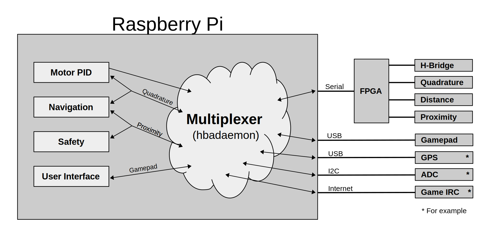

<!-- $theme: gaia -->
<!-- template: invert -->

---

# Today

* System Architecture
* hbadaemon API
* Hands-on Demo of hbadaemon using a gamepad
* Hands-on HBA Application using Bash
* hbadaemon Protocol
* Python program to read the gamepad
* Minimal Python program to control the robot
* Next steps and Q&A

---

# System Architecture

* hbadaemon
  * Event driven multiplexer
  * Reformats and routes message between apps and devices
  * Plug-in based
  * Publish/subscribe for sensor data distribution
  * Not specific to FPGAs.  Use with USB, SPI, I2C, serial, ...
* Each plug-in has one or more 'resources' or 'attributes'
  * Resources are application visible read/write control points (hbaget, hbaset)
  * A resources may also be a stream of sensor data (hbacat)

---

# hbadaemon API

* hbadeamon commands
  * `hbaloadso <plug-in.so>`
  * `hbaget <name|ID#> <resource_name>`
  * `hbaset <name|ID#> <resource_name> <value>`
  * `hbacat <name|ID#> <resource_name>`
  * `hbalist [name]`
* ASCII text over TCP
  * Text/words are easy to understand and remember
  * Simple enough to not need per language binding
  * Command syntax maps easily to shell commands and arguments
* Protocol responds with a prompt or an error message
  * Not visible using shell commands
  * Your program must get the response after every command
  * Response is a prompt ('\') or an error ('E') string
  * Not handling the prompt is the single biggest programming error

---

# Hands-on Demo of hbadaemon 
```
hbalist
hbalist gamepad
hbaset gamepad period 0 
hbacat gamepad state
^C
# output just L/R joystick controls
hbaset gamepad filter edffff
hbacat gamepad state
^C
```
---

# Hands-on HBA Application using Bash
```
hbaset hba_motor mode ff
hbacat gamepad state | 
while read l r
do
   motl=$(( ($l + 32768) / 654 ))
   motr=$(( ($r + 32768) / 654 ))
   echo $motl $motr
   hbaset hba_motor motor0 motl
   hbaset hba_motor motor1 motr
done
```
---

# Python program to control the robot
```
#!/usr/bin/env python
import socket
import sys
''' This program opens two sockets to the hbadaemon, one
    to listen for gamepad events and one to update the
    leds.  This code uses a blocking read but a select()
    implementation would work too.
'''

# Send a set command to the fpga and wait for the reponse prompt
def set_cmd(sock, set_str):
    sock.send(set_str)
    while True:
        retval = sock.recv(1)
        if retval == '\\':
            break


try:
    sock_cmd = socket.socket(socket.AF_INET, socket.SOCK_STREAM)
    sock_cmd.connect(('localhost', 8870))
    sock_gamepad = socket.socket(socket.AF_INET, socket.SOCK_STREAM)
    sock_gamepad.connect(('localhost', 8870))
    set_cmd(sock_gamepad, 'hbaset gamepad filter edffff\n')
    sock_gamepad.send('hbacat gamepad state\n')
    # loop forever getting gamepad joystick positions  
    while True:
        gamepad_state= sock_gamepad.recv(1024).split()
        # Gamepad analog controls output a value between -32767 and
        # +32767.  Map this range to a range of 0 to 15.
        leftleds = 15 - ((int(gamepad_state[1]) + 32767) / 4096)
        rightleds = 15 - ((int(gamepad_state[2]) + 32767) / 4096)
        # Combine the two four bit value and send to the LEDs
        hexleds = format((leftleds * 16) + rightleds, '02x')
        set_cmd(sock_cmd, 'hbaset hba_basicio leds '+hexleds+'\n')


except KeyboardInterrupt:
    # exit on Ctrl^C
    sock_cmd.close()
    sock_gamepad.close()
    sys.exit()

except socket.error:
    print "Couldn't connect to hbadaemon"
    sys.exit()
```
---

# The Case for hbadaemon and FPGA peripherals

* Peripherals can get close to 100% code reuse.
  * Swap FPGA peripherals in and out of your design
  * Swap Linux drivers (actually plug-ins) in and out
* Next steps
  * Review peripherals/hba*/sw/*.c to see how to write FPGA plug-ins
  * Be sure to learn how to move peripherals around on the FPGA. (see top.v) 
* Peripherals are cumulative.
  * Now: GPIO, PWM, ultrasonic distance, quadrature decoding
  * Later: It's up to us.  What peripheral will you create?

---
