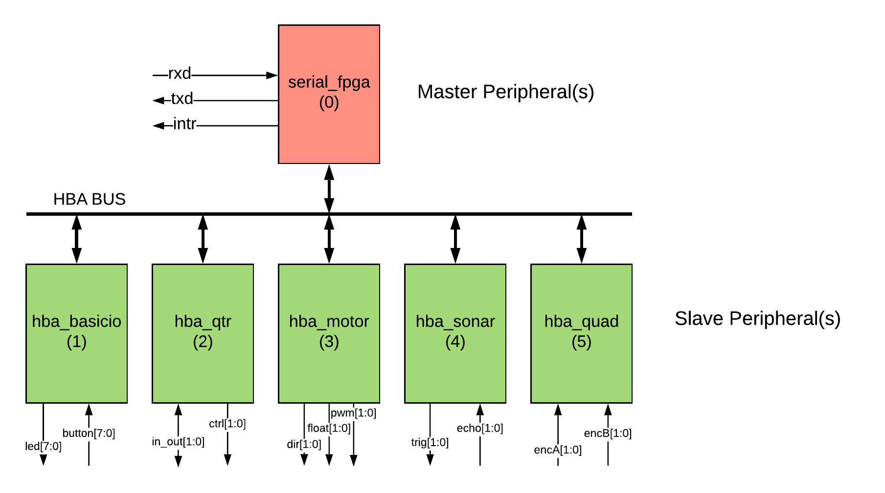
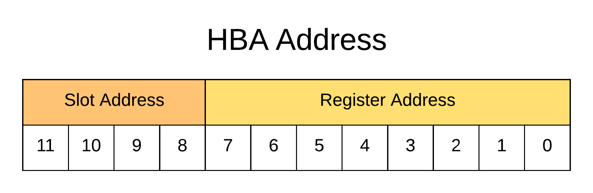
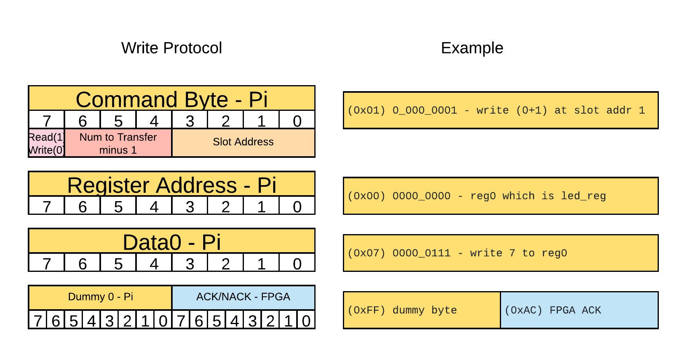
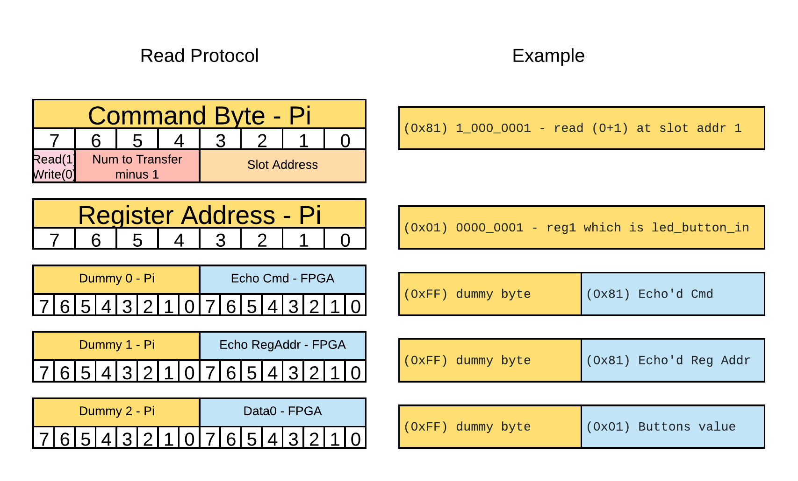
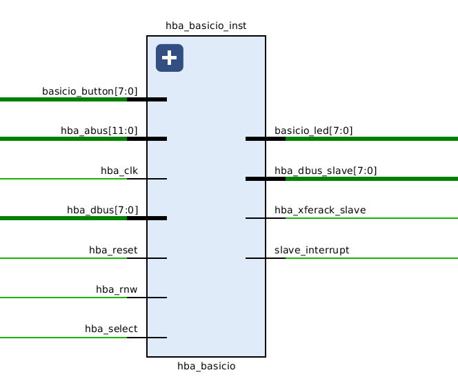

<!-- $theme: gaia -->
<!-- template: invert -->

---

# Today

* FPGA HBA Architecture
* Serial Pi to FPGA Interface
* Serial Demo Using raw read/write
* HBA Peripheral Interface
* HBA BasicIO Peripheral
  * Review peripheral's Verilog
  * Review peripheral's HBA plugin

---

# FPGA HBA Architecture

* Serial (UART) interface between Pi and FPGA
* HBA Bus connects Peripherals
* Each Peripheral is assigned a slot
* Peripheral can be Master, Slave or Both
* Slave Peripherals
  * Contain bank of registers
  * Registers can be Read, Write or Both.
  * Used to setup peripherals and to read data
* Master Peripherals
  * Can read/write to Slave Peripheral registers
  * HBA Bus supports multiple master

---

# Serial Interface

The Raspberry Pi uses the serial interface to read and write to the
HBA Peripheral registers.  So the Raspberry Pi is a Master on the HBA Bus.

* Serial Interface (from perspective of rasp-pi)
  * __rpi_txd__  : Transmit data to the FPGA.
  * __rpi_rxd__  : Receive data from the FPGA
  * __rpi_intr__ : Interrupt from FPGA. Indicates FPGA has data to be read.



* Addressing Peripherals is 12 bits and is split into two parts.
  * The upper 4 bits select the desired peripheral slot.  There are 16 possible slots.
  * The lower 8 bits select the desired peripheral register.  There are 256 possible registers.

* __Note__: To receive a byte from the FPGA the Pi must send a dummy byte.
* The serial interface is full duplex.
* [Serial Interface Documentation](https://github.com/hbrc-fpga-class/peripherals/blob/master/doc/serial_interface.md) 
More information about the serial interface.

---

# Write Protocol


* Command Byte:
  * 7   - Write(0) operation
  * 6:4 - Number of Registers to write minus 1.  So (1-8) possible.
  * 3:0 - Peripheral Slot Address
* Starting Peripheral Register Address. Auto increments if multiple data.
* Data0 .. DataN : The data to write.
* ACK/NACK : Pi sends dummy byte. FPGA sends ACK, indicates successful write of data.

---

# Read Protocol


* Command Byte:
  * 7   - Read(1) operation
  * 6:4 - Number of Registers to read minus 1.  So (1-8) possible.
  * 3:0 - Peripheral Slot Address
* Starting Peripheral Register Address. Auto increments if multiple data.
* Echo Cmd : The Pi sends a dummy byte.  The FPGA echos the cmd byte.
* Echo RegAddr : The Pi sends a dummy byte.  The FPGA echos the RegAddr byte.
* Data0 .. DataN : The Pi sends dummy byte for each reg read.  The FPGA sends reg value.

---

# Serial demo using raw read/write

* Usually use HBA resources for accessing peripherals
* However it is possible to echo all the byte received from the FPGA
* Useful for development and debug
* In one robot terminal type:
```
hbacat serial_fpga rawin
```

* It is also possible to send raw bytes to the FPGA
* Example 1 write 7 to leds
  * Slot 1 peripheral, Reg0 to the value 07
  * This should be the hba_basicio led register
* In another robot terminal type:
```
hbaset serial_fpga rawout 01 00 07 ff

```

* Example 2 read button value
  * Slot 1 peripheral, Reg1 (read)
  * This is the hba_basicio button_in register
* Type
```
hbaset serial_fpga rawout 81 01 ff ff ff

```

---

# HBA Bus Slave Interface

* __hba_clk (input)__ : This is the bus clock.  The HBA Bus signals are valid on the
  rising edge of this clock. 
* __hba_reset (input)__ : This signal indicates the peripheral should be reset.
* __hba_rnw (input)__ : 1=Read from register. 0=Write to register.
* __hba_select (input)__ : Indicates a transfer in progress.
* __hba_abus[11:0] (input)__ : The address bus.
    * __bits[11:8]__ : These 4 bits are the peripheral address. Max number of
      peripherals 16.
    * __bits[7:0]__ : These 8 bits are the register address. Max 256 reg per
      peripheral.
* __hba_dbus[7:0] (input)__ : Data sent to the slave peripherals.
* __hba_xferack_slave (output)__ : Acknowledge transfer requested.  Asserted when request has been
  completed. Must be zero when inactive.
* __hba_dbus_slave[7:0] (output)__ : Data from the slave.  Must be zero when inactive.
* __hba_interrupt_slave (output)__ : Each slave has a dedicated signal back to
  a interrupt controller. If not used tie to zero.
* [HBA Bus Documentation](https://github.com/hbrc-fpga-class/peripherals/blob/master/doc/hba_bus.md) 
More information about the HBA Bus.

---

# hba_basicio Peripheral 



* [hba_basicio documentation](https://github.com/hbrc-fpga-class/peripherals/tree/master/hba_basicio)
* [hba_basicio driver readme](https://github.com/hbrc-fpga-class/peripherals/blob/master/hba_basicio/sw/readme.txt)

---

# hba_basicio Peripheral Verilog Interface

```
module hba_basicio #
(
    // Defaults
    // DBUS_WIDTH = 8
    // ADDR_WIDTH = 12
    parameter integer DBUS_WIDTH = 8,
    parameter integer PERIPH_ADDR_WIDTH = 4,
    parameter integer REG_ADDR_WIDTH = 8,
    parameter integer ADDR_WIDTH = PERIPH_ADDR_WIDTH + REG_ADDR_WIDTH,
    parameter integer PERIPH_ADDR = 0
)
(
    // HBA Bus Slave Interface
    input wire hba_clk,
    input wire hba_reset,
    input wire hba_rnw,         // 1=Read from register. 0=Write to register.
    input wire hba_select,      // Transfer in progress.
    input wire [ADDR_WIDTH-1:0] hba_abus, // The input address bus.
    input wire [DBUS_WIDTH-1:0] hba_dbus,  // The input data bus.

    output wire [DBUS_WIDTH-1:0] hba_dbus_slave,   // The output data bus.
    output wire hba_xferack_slave,     // Acknowledge transfer requested. 
                                    // Asserted when request has been completed. 
                                    // Must be zero when inactive.
    output reg slave_interrupt,   // Send interrupt back

    // hba_basicio pins
    output wire [7:0] basicio_led,
    input wire [7:0] basicio_button
);

```

---

# hba_basicio HBA Pluggin in C

TODO

---
