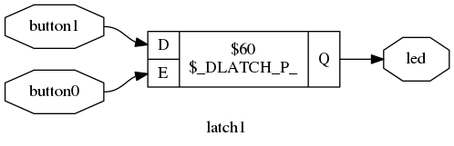
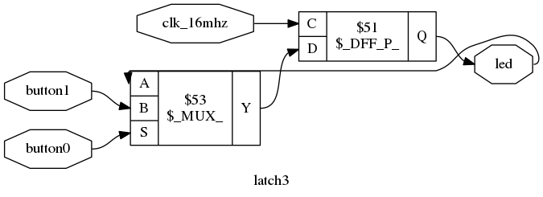

# Latch Notes

Basically a latch is a "clockless" memory element.  
One way they can be create is with cross-coupled NAND gates.
See this [wikipedia article](https://en.wikipedia.org/wiki/Flip-flop_(electronics)#Simple_set-reset_latches) about various latch types.

In general latches are something we want to avoid synthesizing
in our FPGA designs.  The main reason is the FPGA timing tools
work well with synchronous designs that have state stored in
clocked flip flops.  Latches can degrade timing performance of the design.

## latch1.v

```verilog
module latch1
(
    input wire clk_16mhz,
    input wire button0,
    output reg [7:0] led
);

assign led[7:1] = 7'b0;

always @ (*)
begin
    if (button0) begin
        led[0] <= ~led[0];
    end
end

endmodule
```

The Verilog code above instantiates a latch.  The reason is because:
1. It is a __combinatorial__ always block
2. The **else** clause of the **if** statement is missing.
If **en** == 0 then Verilog assumes that **led[0]** should retain its
current state. Since this is a __combinatorial__ always block with
no clock, the only way to maintain state is with a latch.

Here is the result after generic synthesis using [yosys](http://www.clifford.at/yosys/).



## latch2.v

```verilog
module latch2
(
    input wire clk_16mhz,
    input wire button0,
    output reg [7:0] led
);

assign led[7:1] = 7'b0;

always @ (*)
begin
    if (button0) begin
        led[0] <= ~led[0];
    end else begin
        led[0] <= 0;
    end
end

endmodule
```

In the example above, no latches are infered because we
have added an **else** that sets **led[0] <= 0;**

Note: That if our **else** clause was **led[0] <= led[0];**
that would infer a latch, and be equivalent to **latch1.v**
above.  

Here is the result of generic synthesis of **latch2.v** using yosys.


## latch3.v

```verilog
module latch3
(
    input wire clk_16mhz,
    input wire button0,
    output reg [7:0] led
);

assign led[7:1] = 7'b0;

always @ (posedge clk_16mhz)
begin
    if (button0) begin
        led[0] <= ~led[0];
    end
end

endmodule
```

This last example is the same as **latch1.v** except we have
a **synchronous** always block with a clock.  In this case
no latches are infered because the state is stored in a clocked
flip flop.

Here is the **yosys** synthesis results:



## Additional Resources
* [https://www.nandland.com/articles/what-is-a-latch-fpga.html](https://www.nandland.com/articles/what-is-a-latch-fpga.html)
* [https://www.doulos.com/knowhow/verilog_designers_guide/synthesizing_latches/](https://www.doulos.com/knowhow/verilog_designers_guide/synthesizing_latches/)


