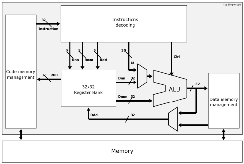
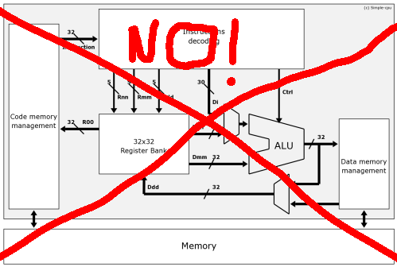
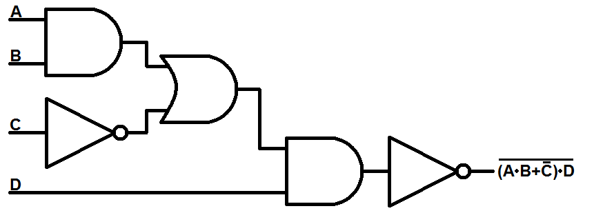
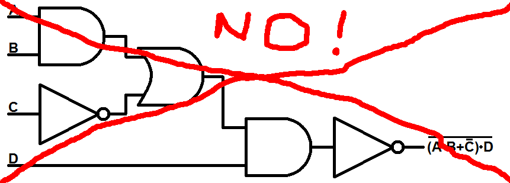
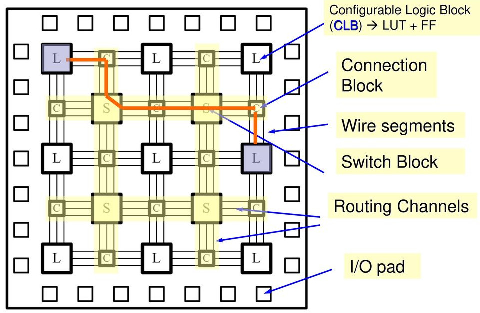
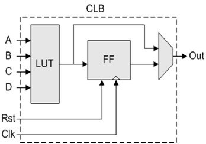
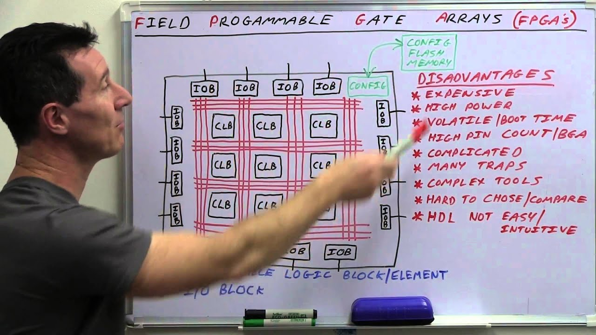
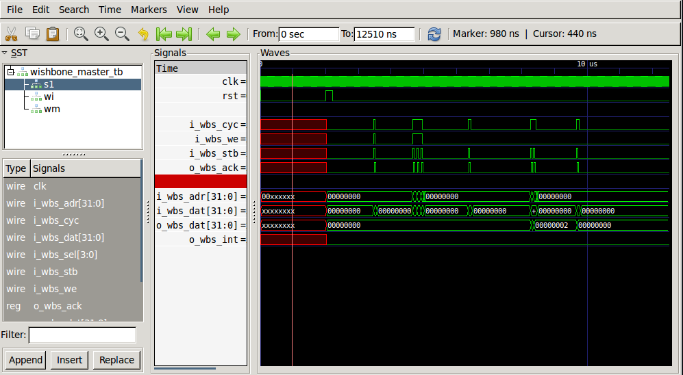
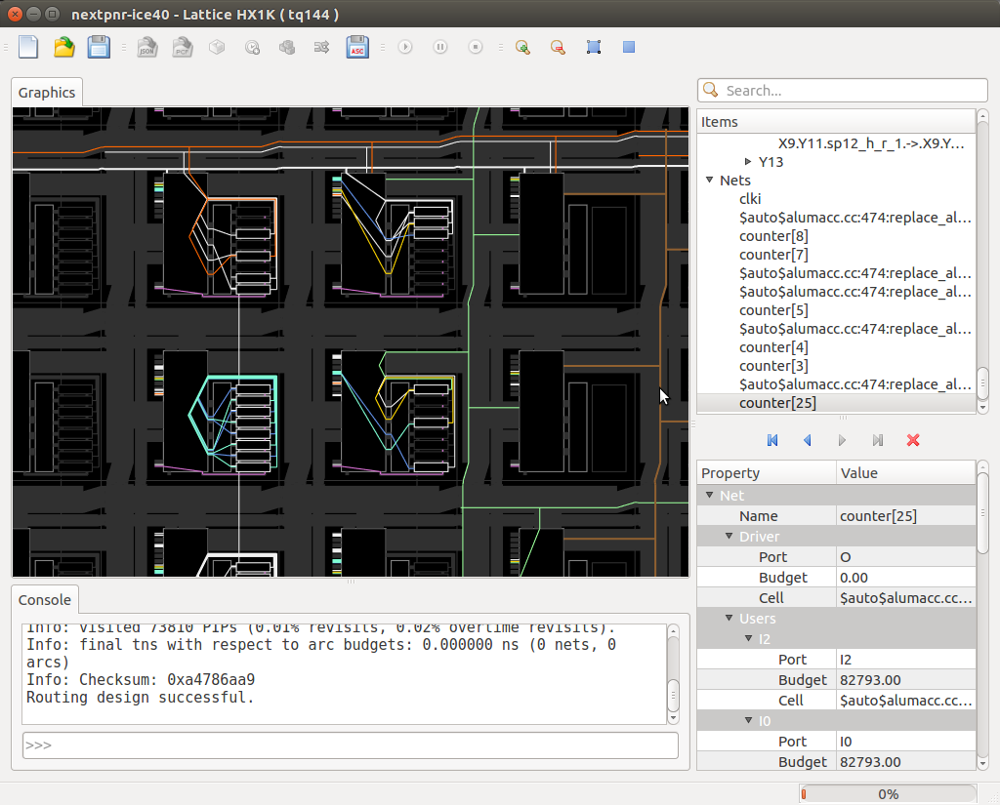

<!-- $theme: gaia -->
<!-- template: invert -->
<!-- page_number: true -->

<!-- *page_number: false -->
# Introduction to FPGAs using Homebrew Automation

###### Brandon Blodget, Patrick Lloyd, & Bob Smith

---

# Who Are We?

* Tinkerers with a bunch of software, hardware, firmware, and gateware experience (mostly Bob and Brandon, though :wink:)
* Engineers at OLogic, Inc.
* [ClusterFighters!](https://clusterfights.com/)

 

---

# What is an FPGA?
 

> To control a processor, you program it with instructions and tell it what to **do**...  
> to control an FPGA, you describe a circuit and tell it what to **become**.  

<small>- Dalai Lama, probably</small>
 

---

* Short for ==**F**ield-**P**rogrammable **G**ate **A**rray==
* One type of Programmable logic device (PLD)
  * Most are re-programmable (these days)
  * Some are non-volatile, while others require external memory to save configuration
* Other PLD's include:
  * PLA - Programmable Logic Array
  * PAL - Programmable Array Logic
  * GAL - Generic Array Logic
  * CPLD - Complex Programmable Logic Device

---

# FPGA Vendors
* **Xilinx** - 50%
* **Intel** (Altera) - 40%
* **Lattice** - 6%
* **Microchip** (Microsemi (Actel)) - 4%
* Others (QuickLogic, Gowin, etc.) - 1%

---

# What's _Inside_ an FPGA?

* Is it a special type processor?

---

# What's _Inside_ an FPGA?

* But an FPGA can be used to _implement_ "soft core" CPUs
---

# What's _Inside_ an FPGA?

* Is it a big collection of AND / OR / NOT / NOR / NAND / NOR gates?

---
# What's _Inside_ an FPGA?

* But an FPGA can be used to _implement_ arbitrary logic equations

---

--- 

# Configurable Logic Blocks

* Lookup table (LUT)
* D-Type Flip-Flop (D-FF)
* Multiplexer (MUX)

---

# Applications of FPGAs

* ASIC prototyping [[RISC-V]](https://www.microsemi.com/product-directory/mi-v-embedded-ecosystem/4406-risc-v-cpus)
* Chip emulation [[MiSTer]](https://github.com/MiSTer-devel/Main_MiSTer/wiki)
* DSP - filters, transforms, convolution, decimation, digital synthesis, etc.
  * Software-defined radio [[1]](https://www.annapmicro.com/solutions/sw-defined-radio/) [[2]](http://ebrombaugh.studionebula.com/radio/iceRadio/index.html) [[3]](https://archive.fosdem.org/2017/schedule/event/sdr_fpga/)
  * Synthesizers [[1]](https://web.wpi.edu/Images/CMS/ECE/Veilleux_Briggs_FPGA_Digital_Music_Synthesizer.pdf) [[2]](https://hackaday.com/2011/07/10/improved-fpga-synth/)

---

# Applications of FPGAs

* Accelerator cores
  * Cryptography - [[MD5]](https://github.com/John-Leitch/fpga-md5-cracker) [[AES]](https://opencores.org/projects/aes_core)
  * Video encode / decode [[H.264]](https://github.com/bcattle/hardh264)
  * Very high speed networking [[Intel 100G NIC]](https://www.intel.com/content/www/us/en/programmable/products/intellectual-property/ip/interface-protocols/m-alt-ll100gb-ethernet.html)
* In general, FPGAs are great at applications requiring fixed point math, high memory bandwidth, pipelining, & parallelism

---

# It can't be all good, right?

---

# Disadvantages

FPGAs are ill-suited for certain tasks:
* Floating point operations
* Protocol handling
* Complex rulesets
* Sequential, unparallelizable tasks, a.k.a. [P-complete](https://en.wikipedia.org/wiki/P-complete) problems like Conway's Game of Life
* Developing solutions quickly (maybe)

---

# Why use one for robotics?

* Access to tons of flexible, reconfigurable I/O pins
* Timers & counters are trivial to impement
  * PWM for motor control (brushed, BLDC, servos)
  * Pulse decoding (encoders, IR remotes, RC controllers, SONAR)
* Swappable, on-demand peripherals like UART, SPI, I2C, 1-wire, etc.
* (Fixed point) PID controllers with very fast execution and consistent timing

---

# FPGA Workflow

* Design entry
* Simulation
* Synthesis
* Technology mapping
* Placement 
* Routing
* Bitstream generation
* Flashing device

---

# Design Entry
* FPGA internals are _described_ using a hardware description language (HDL)
  * Verilog (C-like, weakly-typed)
    * Popular in open source, consumer electronics, & the west coast
  * VHDL (Ada-like, strongly typed)
    * Popular in defense / aerospace, academia, & the east coast
* Tools: Your favorite text editor
---

# Simulation

* Allows designs to be verified as individual blocks or as a full system
* Only simulates _functionality_ of a design, not the physics. This means a design can work in simulation but fail when trying to work with real hardware
* Tools:
  * Simulator - [Icarus Verilog](http://iverilog.icarus.com/), [Verilator](https://www.veripool.org/wiki/verilator)
  * Waveform Viewer - [GTKWave](http://gtkwave.sourceforge.net/)

---

# Simulation

---

# Synthesis

* Convert HDL into generic logic circuits (AND / OR / NOT / etc.)
* Maybe perform some logic optimization
* Output saved as an intermediate file format not intended for human interaction
* Tools: [Yosys](http://www.clifford.at/yosys/)
  * `synth` command provides good set of defaults that can be used as basis for synthesis scripts
    * `yosys> read_verilog mydesign.v`
    * `yosys> synth -top mytop`

---

# Technology Mapping

* Synthesizer output needs to be mapped to the specific hardware architecture of the FPGA (i.e. CLBs, DSP, SERDES, etc.)
* Tools: [Yosys](http://www.clifford.at/yosys/)
  * Multiple scripts are used to map the design
    * `yosys> dfflibmap # map flip-flops to library`
    * `yosys> abc # map logic to library`
  * Supports **extensible, custom techmaps!**
  * Returns text file to be consumed by P&R tool

---

# Placement & Routing

* Tool consumes techmapped design, tries to fit it into the FPGA, and connect everything together, and generate a **bitstream file**.
* NP-hard optimization problem (think "travelling FPGA salesman") 
* Timing constraints factor in at this step 
* Tools:
  * [Nextpnr](https://github.com/YosysHQ/nextpnr) - Actively developed, still buggy, GUI
  * [Arachne-pnr](https://github.com/YosysHQ/arachne-pnr) - No more development, works for ICE40 only (but reliably)

---

# Placement & Routing

---

# Device Flashing

* Chip-specific (SPI, JTAG, or some custom protocol)
* SRAM (fast, volatile) vs. external flash (slow, non-volatile)
* Tools:
  * `iceprog` - ICE40 dev boards only
  * `openocd` - Programming and debugging
  * `flashrom` - External SPI/I2C flash

---

## Holy cow we're done! 
## Just kidding! Now we can finally start.

--- 

# How to Write Less Verilog
* Full, FPGA solutions  robot solutions are 
* High-level synthesis
* 