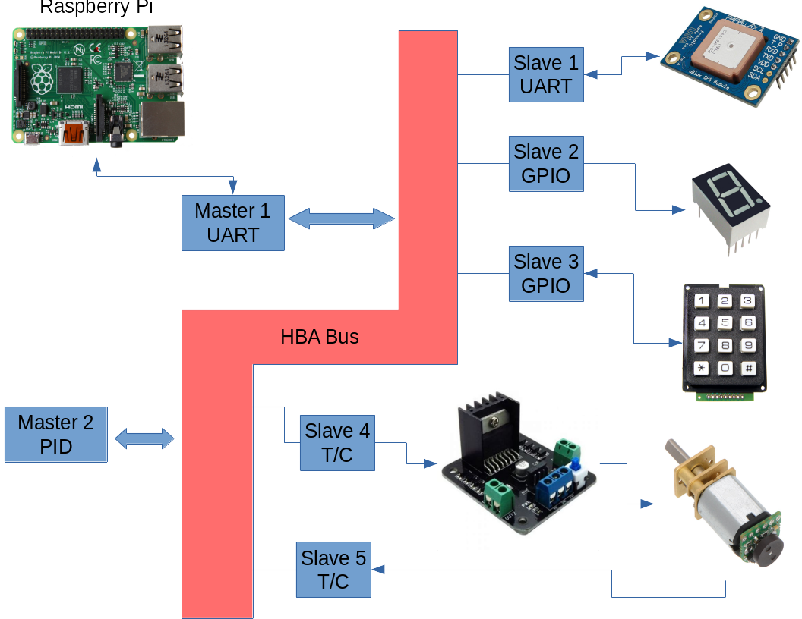
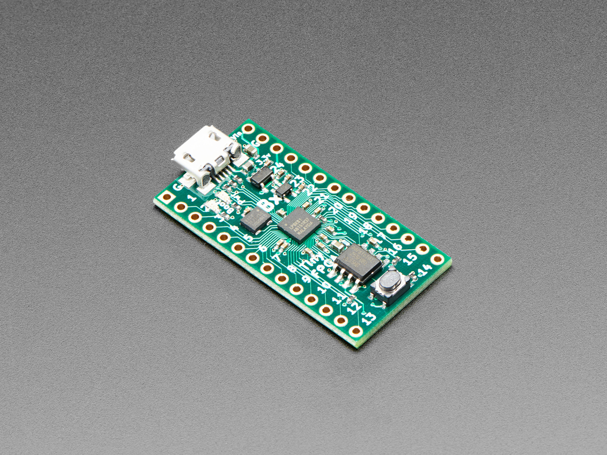
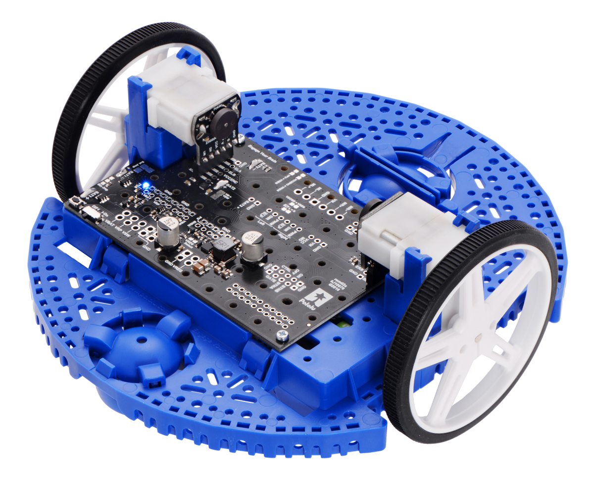
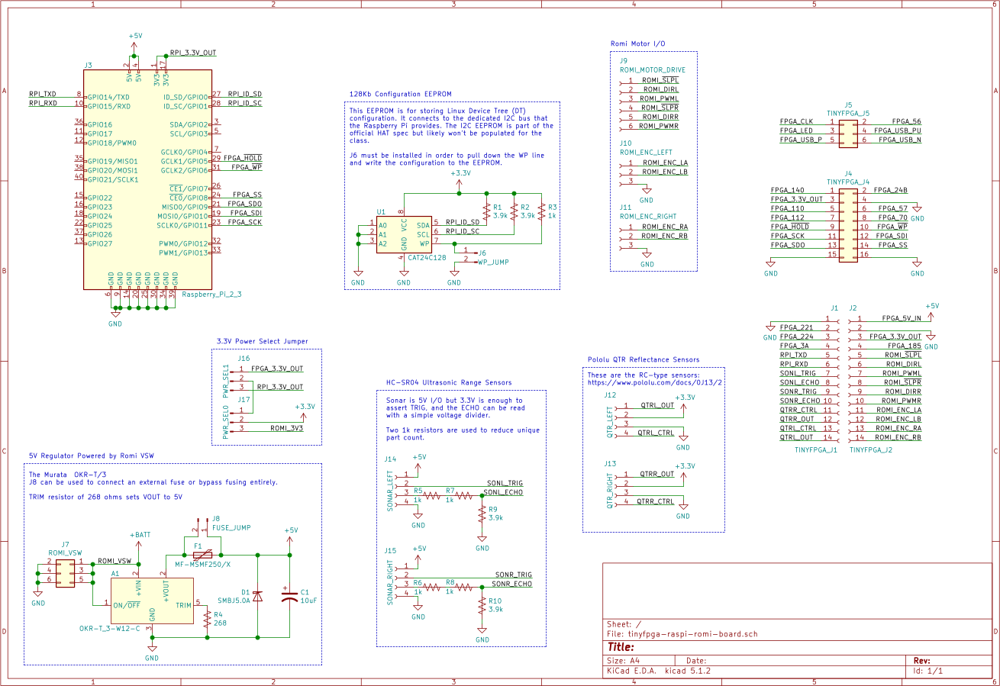

<!-- $theme: gaia -->
<!-- template: invert -->
<!-- page_number: true -->

<!-- *page_number: false -->
<div align=center><b> https://github.com/hbrc-fpga-class/class-material/blob/master/presentation.pdf </b></div>


---

<!-- *page_number: false -->
<!-- *template: default -->
# ==Introduction to FPGAs using Homebrew Automation==

###### Brandon Blodget, Patrick Lloyd, & Bob Smith

---

# About This Talk


* Lots of information - $\frac{\Delta slides}{\Delta time} \propto log(time)$
* Please save questions for the end

---

# Who are We?

* Tinkerers with a bunch of software, hardware, firmware, and gateware experience (mostly Bob and Brandon, though :wink:)
* Engineers at OLogic, Inc.
* [ClusterFighters!](https://clusterfights.com/)

 


---

# What is an FPGA?

<br>

> To control a processor, you program it with instructions and tell it what to **do**... <br>
> to control an FPGA, you describe a circuit and tell it what to **become**. <br>

<div align="right"><small>- Dalai Lama, probably</small></div> 

---

# What is an FPGA?

* Short for ==**F**ield-**P**rogrammable **G**ate **A**rray==
* One type of **Programmable Logic Device (PLD)**
  * Used to implement arbitrary digital logic equations (i.e. Boolean logic)
    * Combinational logic (gates, stateless)
    * Sequential logic (flip-flops, stateful)
  * Most are re-programmable
  * Some are non-volatile, while others require external memory to save configuration

---
# What is an FPGA?

* Other PLD's include:
  * PLA - Programmable Logic Array
  * PAL - Programmable Array Logic
  * GAL - Generic Array Logic
  * SPLD - Simple Programmable Logic Device
  * CPLD - Complex Programmable Logic Device

(Who names these things?)

---

# Players

FPGA vendors by market share:
* **Xilinx** - ~50%
* **Intel** (Altera) - ~40%
* **Lattice** - >5%
* **Microchip** (Microsemi (Actel)) - <5%
* Everyone else (QuickLogic, Gowin, etc.) - ~1%

---

# What's _Inside_ an FPGA?


* Is it a special type processor?

---

# What's _Inside_ an FPGA?


* But an FPGA can be used to _implement_ CPUs (known as "soft cores")
---

# What's _Inside_ an FPGA?


* Is it a big collection of AND / OR / NOT / NOR / NAND / NOR gates? Perhaps even a _gate array_ of sorts?

---
# What's _Inside_ an FPGA?


* But an FPGA can be used to _implement_ arbitrary logic equations

---
# What's _Inside_ an FPGA?


--- 

# Configurable Logic Blocks


* Lookup table (LUT)
* D-Type Flip-Flop (D-FF)
* Multiplexer (MUX)

---

# Open-Source Applications

* ASIC prototyping [[RISC-V]](https://www.microsemi.com/product-directory/mi-v-embedded-ecosystem/4406-risc-v-cpus)
* Chip emulation [[MiSTer]](https://github.com/MiSTer-devel/Main_MiSTer/wiki)
* DSP - filters, transforms, convolution, decimation, digital synthesis, etc.
  * Software-defined radio [[1]](https://www.annapmicro.com/solutions/sw-defined-radio/) [[2]](http://ebrombaugh.studionebula.com/radio/iceRadio/index.html) [[3]](https://archive.fosdem.org/2017/schedule/event/sdr_fpga/)
  * Audio Synthesizers [[1]](https://web.wpi.edu/Images/CMS/ECE/Veilleux_Briggs_FPGA_Digital_Music_Synthesizer.pdf) [[2]](https://hackaday.com/2011/07/10/improved-fpga-synth/)

---

# Open-Source Applications

* Accelerator cores
  * Cryptography - [[MD5]](https://github.com/John-Leitch/fpga-md5-cracker) [[AES]](https://opencores.org/projects/aes_core)
  * Video encode / decode [[H.264]](https://github.com/bcattle/hardh264)
  * Very high speed networking [[Intel 100G NIC]](https://www.intel.com/content/www/us/en/programmable/products/intellectual-property/ip/interface-protocols/m-alt-ll100gb-ethernet.html)
* In general, FPGAs are great at applications that can leverage fixed-point math, high memory bandwidth, pipelining, & parallelism

---

# It can't be all good, right?

---


---

# Disadvantages

FPGAs are ill-suited for certain tasks:
* Floating point operations
* Protocol handling
* Complex rulesets
* [P-complete](https://en.wikipedia.org/wiki/P-complete) problems that are sequential & not easily parallelized (think "Conway's Game of Life")
* Developing solutions quickly (maybe)

---

# The Case for Robotics

* Access to _tons_ of flexible, reconfigurable I/O pins
* Timers & counters are trivial to impement
  * PWM for motor control (brushed, BLDC, servos)
  * Pulse decoding (encoders, IR remotes, RC controllers, SONAR)
* ==Swappable, on-demand peripherals like UART, SPI, I2C, 1-wire, etc.==

---

# The Case for Robotics

* PID controllers
  * Very fast execution and consistent timing
  * Fixed point
* Finite state machines
  * Line following
  * Obstacle avoidance

---

# FPGA Workflow

1. Design entry
2. Simulation
3. Synthesis
4. Technology mapping
5. Placement & Routing
6. Bitstream generation
7. Flashing device

---

# 1. Design Entry

* FPGA internals are _described_ using a hardware description language (HDL)
  * **Verilog** (C-like, weakly-typed)
    * Popular in open source, consumer electronics, & the west coast
  * **VHDL** (Ada-like, strongly typed)
    * Popular in defense / aerospace, academia, & the east coast
* Tools: Your favorite text editor

---

# 2. Simulation

* Allows designs to be verified as individual blocks or as a full system
* Only simulates _functionality_ of a design, not the physics. This means a design can work in simulation but fail when trying to work with real hardware
* Tools:
  * Simulator - [Icarus Verilog](http://iverilog.icarus.com/), [Verilator](https://www.veripool.org/wiki/verilator)
  * Waveform Viewer - [GTKWave](http://gtkwave.sourceforge.net/)

---

# 2. Simulation


---

# 3. Synthesis

* Translates Verilog & RTL schematics into generic logic circuits.
* Some logic optimization happens here
* Output saved as an intermediate file format not really intended for human interaction
* Tools: [Yosys](http://www.clifford.at/yosys/)
  * `synth` command provides good set of defaults that can be used as basis for synthesis scripts
    * `yosys> read_verilog mydesign.v # import design`
    * `yosys> synth -top mytop # default synthesis`

---

# 4. Technology Mapping

* Synthesis output needs to be mapped to the specific hardware architecture of the FPGA (i.e. CLBs, DSP, SERDES, etc.)
* Tools: [Yosys](http://www.clifford.at/yosys/)
  * Multiple scripts are used to map the design
    * `yosys> dfflibmap # map flip-flops`
    * `yosys> abc # map logic`
  * Supports **extensible, custom techmaps!**
  * Returns text file to be consumed by P&R tool

---

# 5. Placement & Routing

* Tool consumes techmapped design, tries to fit it into the FPGA, and connect everything together
* NP-hard optimization problem (think "travelling FPGA salesman") 
* Timing constraints factor in at this step 
* Tools:
  * [Nextpnr](https://github.com/YosysHQ/nextpnr) - Actively developed, still buggy, GUI
  * [Arachne-pnr](https://github.com/YosysHQ/arachne-pnr) - No more development, works for ICE40 only (but reliably)

---

<!-- *page_number: false -->


---

# 6. Bitmap Generation
* The P&R tool generates a binary file known as the **bitstream**
* Morally equivalent to an ELF or EXE
* Each bit controls the configuration state and initial conditions of every CLB and interconnect in the device
* Previously very secret sauce
* Slowy being reverse engineered by hackers _fuzzing_ the vendor tools

---

# 7. Device Flashing

* Chip-specific (SPI, JTAG, or some custom protocol)
* SRAM (fast, volatile) vs. external flash (slow, non-volatile)
* Tools:
  * `iceprog` - ICE40 dev boards only
  * `openocd` - Popular tool to program & debug with
  * `flashrom` - External SPI/I2C flash

---

## Holy cow we're done! 
## Just kidding! Now we can finally start.

--- 

# How to Write Less Verilog
* Code reuse has historically been challenging for FPGA designs
* How to abstract away complexity:
  * High-level synthesis tools
    * **MATLAB** HDL Coder, VivadoHLS (**C/C++**), Intel HLS Compiler (**C**), Synphony (**C**), Migen (**Python**), Litex (**Python**)
  * Configurable IP Megablocks
    * Vendor clock & PLL configuration
    * Common physical layers (PCIe, Ethernet, USB)

---

# How to Write Less Verilog
* Connect the FPGA to a Linux computer & leverage the strengths of both devices

---

# Homebrew Automation

---

# HBA Gateware (FPGA)
* Based on ==TinyFPGA BX (Lattice ICE40)==
* Consists of small, modular peripherals
* Provides standardized interface to a simple bus
* Up to four master peripherals
  * E.g. Raspberry Pi interface or PID controller
* Up to sixteen slave peripherals
  * e.g. timer/counter, SPI, UART

--- 

<!-- *template: default -->


---

# HBA Software (Linux)
* UNIX-like interface design - everything is ASCII 
* Interface presented as command and data resources for each peripheral (think I2C registers)
* ==Only a few basic basic commands:==
  * `hbaloadso <plug-in.so>`
  * `hbaget <name|ID#> <resource_name>`
  * `hbaset <name|ID#> <resource_name> <value>`
  * `hbacat <name|ID#> <resource_name>`
  * `hbalist [name]`
 
---

# HBA Software (Linux)

Motor controller example:
* `mode`: a character in (B)rake, (F)orward, re(V)erse, or (R)otate
* `speed`: the desired speed in ticks/second or meters/second
* `direction`: 0 to 100 with 0=hard left, 50=straight, 100=hard right
* `watchdog`: Brake if no mode, speed, or dir command in this many milliseconds 

---

# HBA Software (Linux)

```Bash
hbaset motors mode b    # brake
hbaset motors speed 50
hbaset motors dir 50
hbaset motors mode f    # and off we go...
while true
do
  sleep 2
  hbaset motors dir 100
  sleep 0.75
  hbaset motors dir 50
done
```

---

# HBA Hardware
* [Raspberry Pi 3 Model B+](https://www.adafruit.com/product/3775) - $45 (incl. extras)
* [TinyFPGA BX](https://www.adafruit.com/product/4038) - $40
* [Pololu Romi Chassis Kit](https://www.pololu.com/category/203/romi-chassis-kits) - $30
* [Pololu Romi Encoder Pair Kit](https://www.pololu.com/product/3542) - $10
* [Pololu Motor Driver and PDB](https://www.pololu.com/product/3543) - $20
* [2x HC-SR04 SONAR sensors](https://www.adafruit.com/product/3942) - $10
* [2x Pololu QTR IR reflectance sensors](https://www.pololu.com/product/4101) - $5
* Custom PCB (power supply & interconnect) - $10?

---



---



---

<!-- *page_number: false -->
<!-- *template: default -->


---

# Class Details

* Where: **Hacker Dojo**
* When: **Wednesday, June 19, 2019 - 7:00pm**
* Cost - **$200** (we'll refund you if materials end up being less)


---

# Questions?

#### All HBA material is on GitHub:

* [https://github.com/hbrc-fpga-class/class-material/blob/master/presentation.pdf](https://github.com/hbrc-fpga-class/class-material/blob/master/presentation.pdf)


