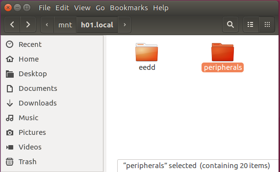
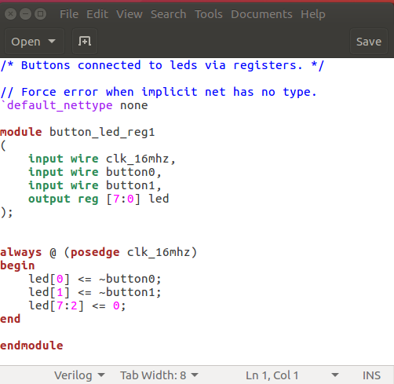

# SSHFS

SSHFS allows you to mount a remote file system over ssh.
Since we log in to our robots over SSH we can use
sshfs to mount our robot to the local file system on
our host computer.

This is useful for it allows you use your computer's
GUI tools to edit or view files that are on the robot.
For example you can use your favorite GUI editor
to edit files on the robot instead of being limited
to editors that run in the terminal.

## Ubuntu/Debian

If your host computer is running Ubuntu sshfs is pretty
easy to setup via:

```
> sudo apt-get install sshfs
```

### Create a mount point

Create a directory where you would like to access your
robots files.  This directory can be anywhere, but
it is common to put it in the /mnt directory.  I named
the directory my robots name.

```
> cd /mnt
> sudo mkdir h01.local
```

### Mount the robots directory

Make sure the robot is turned on and booted, then type:

```
> sudo sshfs ubuntu@h01.local:hbrc_fpga_class h01.local -o allow_other
```

Now you should be able to browse the robot's files through that mount point.





### Unmount

Before shutting down the robot, unmount the sshfs via:


```
> sudo umount /mnt/h01.local
```

## Windows 10

Instruction for getting this working under Windows 10.

[SSHFS Windows](https://codeyarns.com/2018/05/03/how-to-mount-remote-directory-on-windows-using-sshfs-win/)

Here is a summary of the steps:

1. Install WinFSP from [here](https://github.com/billziss-gh/winfsp/releases).  This link takes you
   to a releases github page.  The latest version at the time of this writing is **WinFsp 2019.3
   B2**.  Scroll down the page and click on the **Assets** triangle. Then download the **msi**
   installer.

2. Install SSHFS-Win form [here](https://github.com/billziss-gh/sshfs-win/releases). This link takes
   you to a releases github page.  The latest version at the time of this writing is **SSH-Win 3.5
   BETA**.  Scroll down the page and click on the **Assets** triangle. Then download the appropriate
   **msi** installer.
3. Map a Network Drive
    * Go to "This PC" and select "Map network drive" icon.
    * Select a Drive letter
    * Folder: \\sshfs\ubuntu@192.168.XX.XXX
        * Replace 192.168.XX.XXX with your robot's IP address.
    * Don't check: reconnect at sign-in
    * Do check: Connect using different credentials


Remember to disconnect the Network Drive before powering off the robot.

That's it!

## Mac OS X

Not tested but there is some information about setting it up at:

[Mac OS X SSHFS](https://www.digitalocean.com/community/tutorials/how-to-use-sshfs-to-mount-remote-file-systems-over-ssh)


