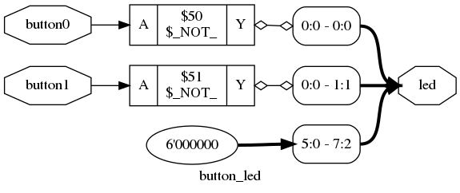
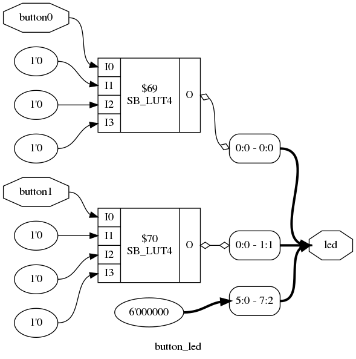
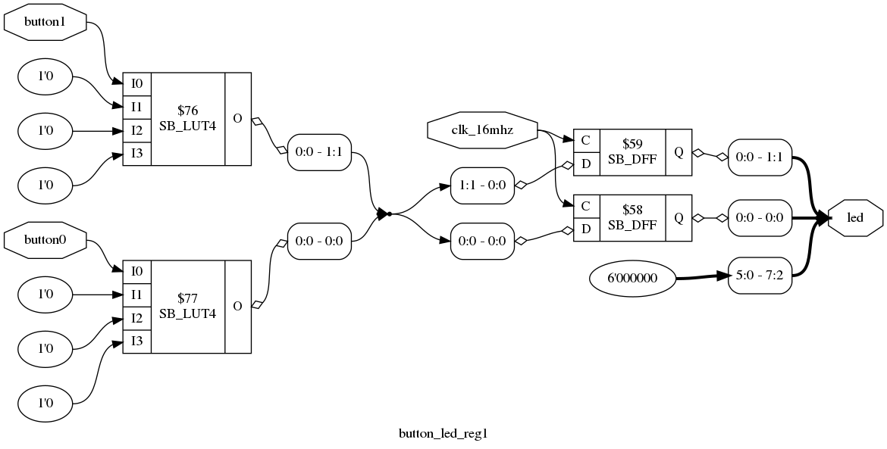
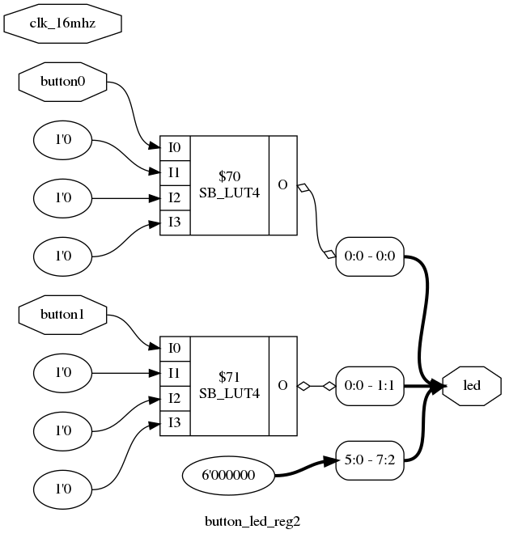

<!-- $theme: gaia -->
<!-- template: invert -->

---

# Overview

* Goals
* Verilog History
* 0 Hello World Verilog
    * Module
    * Initial, always blocks
    * $display
* 1 Button Led
    * Input/output ports
    * Bus widths
    * Pin placement file
    * Implementation Steps
    * Program FPGA
    * Exercise
* 2 Button Led Registers
    * Adding clock
    * Sensitivity list
    * Combinatorial always block
    * Operators
    * Numbers
    * Exercise
* 3 Led Counter
    * Internal registers
    * Initialize reg in initial block
    * Constants
    * Generate a pulse
    * Rules
    * Exercises
    * Resets
    * Shift Registers
    * Concatenation
    * Final Challenge

---

# This tutorials Goals

* Main Focus on Synthesis for FPGAs
* Light coverage of Testbenches
* Covering a subset of Verilog
* Hands-on
* Practical not Theoretical
* Read and Understand the HomeBrew Automation Peripheral's Verilog
* Able to write simple HBA Verilog Peripherals

---

# Verilog History

* Verilog created in the Mid-80s
* Created for simulation
    * "verification" and "logic"
    * High level and gate level simulation
* C like in syntax.
* case-sensitive
* Weakly typed
* Standards:
    * Verilog-95
    * Verilog 2001
        * Supported by most EDA tools
        * Target for this tutorial
    * Verilog 2005
    * SystemVerilog

---

# [0_Hello_World](https://github.com/hbrc-fpga-class/peripherals/tree/master/verilog_tutorial/0_Hello_World)

Login to your robot using ssh and perform the following steps:

```
> cd ~/hbrc_fpga_class/peripherals
> source setup.bash
> cd verilog_tutorial/0_Hello_World
```

The bash script adds the program __prog_fpga.py__ to your path.
We use this program to download fpga bitstreams to the
TinyFPGA board of the Raspberry Pi SPI pins. More about this later.

# hello0.v

```verilog
// Minimal module
module hello0;
endmodule
```

The above code is in the file hello0.v.  It is about as minimal a Verilog
program you can have.

The basic building block in Verilog is the __module__.  We define a module
using the keywords __module__ and __endmodule__.  You build circuits in
Verilog by connecting modules together.  Much like schematic symbols in
a schematic editor.

Verilog is not white-space sensitive.  So you can format it how you like.

Verilog ends every statement with a semicolon.  Well, almost every statement.
Verilog keywords that end statements themselves don't need semicolons.
Examples:  __end__, __endmodule__ and __endcase__.

Notice the C style comment.  Verilog can look a bit C like but...

__Important__ : In Verilog (and other HDLs) you are not programming.  You
are describing circuits (structure and/or behavior).

We can _compile_ hello.v using the [iverilog](http://iverilog.icarus.com/) simulator,
which is pre-installed on the robot's Pi.

```
> iverilog hello0.v
```

If all went well it should have created a file called __a.out__ in the
current directory.  This is a real executable that can be run from the
command line. But it just starts and then quits.

```
> ./a.out
```

Running __iverilog__ in this way is a very quick way to do a
syntax check of your verilog module.

__Exercise__ : Try adding a bogus line to hello0.v and re-run
the __iverilog hello0.v__ command.  What happens?

# hello1.v

```verilog
module hello1;
initial $display("Hello World1");
endmodule
```
The above code is in the file hello1.v.  It is the classic "hello world"
program.

Two new items are introduced:
1. __initial__ : This keyword means start here at time 0.  To have more than
one statement in an initial block, you need to add a "begin/end" block.  An
example of this later.
2. __$display__ : Is a _system task_ that acts a lot like _printf_ in C.  In
   Verilog words that start with a __$__ are special commands called system
   tasks. In general they are not synthesizable (often safely ignored by the
   synthesis tools).  But useful for debug and testbenches.

Try:

```
> iverilog hello1.v
> ./a.out
Hello World1
```

iverilog has a '-o' flag that renames the output executable (much like gcc).

```
> iverilog -o hello1 hello1.v
> ./hello1
Hello World1
```

There is also a Makefile in this directory so you can make the hello1
executable via

```
> make hello1
> ./hello1
Hello World1
```

Cleanup all the generated executables via

```
> make clean
```

# hello2.v

```verilog
module hello2;
initial 
begin
    $display("Hello World2");
    $display("Goodbye");
end
endmodule
```

This module is basically the same as hello1.v but it shows how to create an
__initial__ block with multiple statements, using __begin__ and __end__.

Verilog uses __begin__ and __end__ to delineate blocks.  This is in contrast
to C which uses curly braces __{__ and __}__

# hello3.v

```verilog
module hello3;
always
begin
    #1      // delay one simulation step (unitless by default)
    $display("Hello World3: ",$time);
    if ($time == 100) begin
        $finish;
    end
end
endmodule
```

This module introduces a couple of new concepts:
* __always__ : This keyword is similar to __initial__.  It says start here at
  time 0, and when you get to the end of the block, go back to the beginning of
  the block.  Basically it describes an infinite loop.
* __#1__ :  The __#__ followed by a number, indicates a delay in simulation
  steps.  By default the step size is unitless.  However you can assign units
  and percision using the __`timescale__ directive.  This is mostly used for
  testbench code.  
* __$time__ : Holds the integer part of the simulation time.
* __if__ : The __if__ statement is much like the C if statement.
* __$finish__ : Indicates that the simulation should finish/exit.


Try out this code via:
```
> make hello3
> ./hello3
```

---

# [1_Button_Led](https://github.com/hbrc-fpga-class/peripherals/tree/master/verilog_tutorial/1_Button_Led)

In this section we learn how to specify module inputs and outputs.
In these demos we connect the user buttons to leds on the robot.
We generate a bitstream and download it to the TinyFPGA board.

# button_led.v

```verilog
/* Buttons directly connected to leds. */

module button_led
(
    input wire button0,
    input wire button1,
    output wire [7:0] led
);

assign led[0] = ~button0;
assign led[1] = ~button1;

assign led[7:2] = 0;

endmodule
```

New concepts:
* Between the module name and the __;__ we insert parentheses in which we
  specify our input and output ports.
* We specify the output __led__ to be a bus of 8 wires, with the most significant
  bit being 7 and the least significant bit being 0.
* __assign__ : We assign value to our output bus __led__ using the assign
  statement.  __Note__ assignments are outside of initial or always blocks.

In this example the module button_led is going to be our top level module.  So
the __button0__, __button1__, and __led[7:0]__ ports need to be assigned to
package pins on the FPGA.  We can figure out the mapping between the ports
and package pins using these files:
* [Romi Adapter Board Pcb pdf](https://github.com/hbrc-fpga-class/hardware/blob/rev-A/tinyfpga-raspi-romi-board/outputs/tinyfpga-raspi-romi-board.pdf)
* [TinyFPGA pins top](https://cdn-shop.adafruit.com/1200x900/4038-01.jpg)
* [TinyFPGA pins bottom](https://cdn-shop.adafruit.com/1200x900/4038-00.jpg)

This is done in the file pins.pcf:

```
set_io button0    J4  # PIN_27
set_io button1    D8  # PIN_16

set_io led[0]       A9  # PIN_18
set_io led[1]       B8  # PIN_19
set_io led[2]       J3  # PIN_26
set_io led[3]       A8  # PIN_20
set_io led[4]       J9  # PIN_29
set_io led[5]       B7  # PIN_21
set_io led[6]       E8  # PIN_30
set_io led[7]       A7  # PIN_22
```

# The resulting circuit after synthesis

We will use the [Yosys Open Synthesis Suite](http://www.clifford.at/yosys/)
to synthesize our Verilog code into a circuit.  
Here are the circuit diagrams generated by yosys of the button_led module:

* Generic Synthesis



* ICE40 Synthesis



In the first diagram we see the result of generic synthesis.  We see
the button inputs feed into inverters, that then go to the led.

In the second diagram we specified that the ice40 FPGA should be
our target technology.  With this mapping the inverters are
implemented in the SB_LUT4 primitives. 

# Generating button_led bitstream

First lets use __iverilog__ to verify we don't have any syntax errors:

## Syntax Check

```
> iverilog button_led.v
```

## Synthesis

Next we will use the [Yosys Open Synthesis Suite](http://www.clifford.at/yosys/).
This step will break the design into the target technology primitives.
In our case that is Lattice iCE40 FPGA primitives.
The output will be a [BLIF](http://www.cs.columbia.edu/~cs6861/sis/blif/index.html) file.

```
> yosys -p 'synth_ice40 -top button_led -blif button_led.blif' button_led.v
```

To generate the synthesis diagrams you can use the 
[yosys show](http://www.clifford.at/yosys/cmd_show.html) command:

```
> yosys -p 'synth; clean; show -format png -prefix ys_button_led' button_led.v
> yosys -p 'synth_ice40; clean; show -format png -prefix ys_button_led_ice40' button_led.v

```

The __synth__ option does generic synthesis.  At this time this is not working on the 
class robot.

The __synth_ice40__ option does synthesis targetting the ice40 architecture.  This **is**
working on the class robot.

If you are interested in more information on using yosys for interactive
synthesis, and generating diagrams see
[Yosys Application Note 011: Interactive Design Investigation](http://www.clifford.at/yosys/files/yosys_appnote_011_design_investigation.pdf)


## Place and Route

We are using [arachne-pnr](https://github.com/YosysHQ/arachne-pnr) for place and route.
We should upgrade to [nextpnr](https://github.com/YosysHQ/nextpnr), 
but have not done that yet.

This step takes the design primitives generated by synthesis and maps them
to our target part.  Then it routes the primitives together.

The output is a [IceStorm](http://www.clifford.at/icestorm/) ASC file which
represents the FPGA configuration file. The IceStorm ASCII format has blocks of 0
and 1 for the config bits for each tile in the chip.

```
> arachne-pnr -s 7 -d 8k -P cm81 -o button_led.asc -p pins.pcf button_led.blif
```

## Check timing

The arachne-pnr tool is **not** timing driven.  These means you cannot give it
timing constraints up front and have it work on meeting those constraints.  

You can however run the IceStorm tool __icetime__ to give you a timing report.

We don't currently have a clock in our design, so the timing estimate
is not really needed yet.

In our main HBA project bitstream the clock is running at 50mhz.
So in general we want the timing estimate to be faster than 50mhz.

```
> icetime -d lp8k -mtr button_led.rpt button_led.asc
// Reading input .asc file..
// Reading 8k chipdb file..
// Creating timing netlist..
// Timing estimate: 6.02 ns (166.03 MHz)
```

## Generate Bitstream

If the timing looks good then we will generate the binary bitstream.
The tool __icepack__ converts from the ASCII bitstream to the 
binary bitstream.

```
> icepack button_led.asc button_led.bin
```

## Program the TinyFPGA

The Lattice iCE40 part that is on the TinyFPGA board can be programmed
via SPI.  The Raspberry Pi SPI pins on the GPIO header are routed to 
the SPI programming port on the TinyFPGA board.  

The FPGA can be programmed from the on board SPI flash, or from
the Raspberry Pi.  There is a GPIO pin on the Pi that selects between
the two.  

Unfortunately the TinyFPGA does not route the CRESET (configuration reset)
signal to an external pin.  So we have to manually press the CRESET button at
the appropriate time. 

There is a program __prog_fpga.py__ which is in the [utils](https://github.com/hbrc-fpga-class/peripherals/tree/master/utils) directory.

There is a script
[setup.bash](https://github.com/hbrc-fpga-class/peripherals/blob/master/setup.bash)
that you can source that will add __prog_fpga.py__ to your path.  Once it is in
your path you can program the bitstream with the following... It will prompt you
when to press the CRESET button.

```
> prog_fpga.py button_led.bin
```

Now you can press the two user buttons and turn on two leds!!

If you want the default bitstream back you can press the CRESET button
again and it will load it from the SPI flash!!

## The Makefile

In the *1_Button_Led* directory there is a Makefile.  So you can run all the step above via

```
> make
```

And program the bitstream with

```
> make prog
```

## Exercise : A Verilog Gotcha!

By default Verilog does not require you define a wire before you use it.
This can be an issue if you have a typo in a wire name.

Update line 11 in button_led.v to the following:
```
assign ld = ~button1;
```

Now run our syntax check again:

```
> iverilog button_led.v
```

No errors!!

Now update button_led.v so it looks like this:

```verilog
/* Buttons directly connected to led. */

// Force error when implicit net has no type.
`default_nettype none

module button_led
(
    input wire button0,
    input wire button1,
    output wire [7:0] led
);

assign led[0] = ~button0;
// XXX assign led[1] = ~button1;
assign ld = ~button1;

assign led[7:2] = 0;

endmodule
```

Now run our syntax check again:

```
> iverilog button_led.v
button_led.v:15: error: Net ld is not defined in this context.
1 error(s) during elaboration.
```

That is better.

The __`default_nettype none__ directive says if a net has not been explicitly defined
give its nettype the value of __none__, which causes an error if it is used.

In general I think it is a good idea to add to the top of your verilog files.

```
// Force error when implicit net has no type.
`default_nettype none
```

The one place this can get you in trouble is if you are using modules from a 3rd
party that takes advantage of the default behavior.

---

# [2_Button_Led_Reg](https://github.com/hbrc-fpga-class/peripherals/tree/master/verilog_tutorial/2_Button_Led_Reg)

In this section we learn about the __reg__ keyword.

## button_led_reg1.v

```verilog
/* Buttons connected to leds via registers. */

// Force error when implicit net has no type.
`default_nettype none

module button_led_reg1
(
    input wire clk_16mhz,
    input wire button0,
    input wire button1,
    output reg [7:0] led
);


always @ (posedge clk_16mhz)
begin
    led[0] <= ~button0;
    led[1] <= ~button1;
    led[7:2] <= 0;
end

endmodule
```

This module behaves pretty much the same as the 1_Button_Led module.
Here are some differences to notice:
* We add another input port called __clk_16mhz__.  It has been added to
  _pins.pcf_ as well.
* Output port __led__ is specified as a __reg__ instead of a __wire__.  The
  __assign__ statement we used in the previous example, only works with
  __wire__.  If we set values in an __always__ (or __initial__) block we must
  use a __reg__ on the left hand side of the assignment.
* After the __always__ there is __@ (posedge clk_16mhz)__.  The __@__ operator
  is called the _change operator_.  And the signals in the parenthesis are
  called the sensitivity list. Remember the __always__ block is an infinite
  loop, but now it will only enter the next iteration of the loop on the
  positive edge of clk_16mhz.
* The assignment operator in the __always__ block is __<=__.  This is the __non
  blocking assignment operator__.  This means that the three assignment
  operations happens simultaneously on the rising edge of clk_16mhz.  The
  __led[1:0]__ signals will be implemented as D flip flops.  The __led[7:2]__
  signals probably will be optimized out since the value never changes.

You can build the bitstream for this module and program the TinyFPGA in one shot
via:

```
> make button_led_reg1
```

## button_led_reg2.v

```verilog
/* Buttons connected to leds via combinatorial path. */

// Force error when implicit net has no type.
`default_nettype none

module button_led_reg2
(
    input wire clk_16mhz,
    input wire button0,
    input wire button1,
    output reg [7:0] led
);


always @ (*)
begin
    led[0] <= ~button0;
    led[1] <= ~button1;
    led[7:2] <= 0;
end

endmodule
```

Notice the __always @ (*)__ statement.  Here we replaced the __posedge clk_16mhz__
with a __*__.  The asterisk means we are sensitive to changes on any signal.
This is a way to generate combinatorial logic with no registers.  So even
though the led was defined with the __reg__ keyword, no registers will
be created in this module.  However since __led__ is set in an 
__always__ block it must be of type register.

You can build this bitstream and download via:

```
> make button_led_reg2
```

## Comparing synthesis of button_led_reg1.v and button_led_reg2.v

Below we can see the difference between the synthesis results
of button_led_reg1.v and button_led_reg2.v.  Ice40 is the target technology.

* button_led_reg1 synthesis



* button_led_reg2 synthesis



We can see that in __button_led_reg1__ D flip flops (SB_DFF) are
instantiated.

In __button_led_reg2__ there are **no** D flip flops in the design.
Infact, this circuit diagram looks the same as the __button_led.v__
synthesis diagram that did not use the always block. 

It shows:
* That just because you use a **reg** type you don't necessarly get a
  register.
* Different looking Verilog code can generate the same circuits.

---

# Value Set

Verilog has 4-state logic.

* 0 : Logic 0 or false
* 1 : Logic 1 or true
* x : Unknown logic value (sim)
* z : High impedance of tristate gate (sim)

# Operators

## Assignment Operators

* __=__
    * blocking assignment
    * used for continuous assignments (rule of thumb for synthesizable)
    * used with the __assign__ statement
* __<=__
    * non-blocking assignment
    * used for procedural assignments (rule of thumb for synthesizable)
    * used in __always__ blocks

In practice blocking versus non-blocking is more for the simulator than
for the synthesis tools.  Remember Verilog started as a simulation
tool.  In button_led_reg1.v if you replace the __<=__ with __=__ it will
synthesize the same.

## Arithmetic Operators

* __+__  : Addition
* __-__  : Subtraction
* __*__  : Multiplication
* __/__  : Division
* __%__  : Modulus
* __**__ : Power

## Bitwise Operators

* __|__   : OR
* __&__   : AND
* __^__   : XOR
* __<<__  : Shift left
* __>>__  : Shift right
* __<<<__ : Signed shift left
* __>>>__ : Signed shift right

## Logical Operators

* __||__   : Logical OR
* __&&__   : Logical AND

## Negation Operators

* __~__   : Bitwise negation
* __!__   : Logical negation

## Equality Operators

* __==__    : Equivalence (used for synthesizable)
* __===__   : Literal Equivalence (used in testbench 'x', 'z')
* __!=__    : Inequality (used for synthesizable)
* __!==__   : Literal Inequality (used in testbench 'x', 'z')
* __<__     : Less than
* __>__     : Greater than
* __<=__    : Less than or equal to
* __>=__    : Greater than or equal to

## Ternary Operator

* __led[0] = (button1==1) ? 1 : 0;__

## Numbers

Number have the following format in Verilog:

[number of bits]'[radix][value]

Here are the radix specifiers
* 'b 'B     // Binary
* 'd 'D     // Decimal (default)
* 'h 'H     // Hexadecimal
* 'o 'O     // Octal

In the __value__ part you can insert underscores to improve readability.

Here is an example of assigning numbers to wires;

```verilog
wire [7:0] in1;
wire [7:0] in2;
wire [7:0] in3;
wire [9:0] sum;

assign in1 = 8'h0c;         // hex number
assign in2 = 8'b1010_1010;  // binary number
assign in3 = 249;           // default decimal number

assign sum = in1 + in2 + in3;
```

The current versions of Verilog also allow you to make assignments
when you define the wire.  So the above could be written as

```verilog
wire [7:0] in1 = 8'h0c;         // hex number
wire [7:0] in2 = 8'b1010_1010;  // binary number
wire [7:0] in3 = 249;           // default decimal number
wire [9:0] sum = in1 + in2 + in3;
```

## Reduction Operators

* __|__   : Reduction OR
* __&__   : Reduction AND
* __^__   : Reduction XOR (parity)

Example:
```verilog
wire [9:0] sum;
wire parity;

assign parity = ^sum; // xor all sum's bits
```

## Exercise

Update __button_led_reg2.v__ so that pressing either button will
turn on led[0] and led[1]

Test your change, by generating a new bitstream and downloading
to the TinyFPGA

```
> make button_led_reg2
```

---

# [3_Led_Counter](https://github.com/hbrc-fpga-class/peripherals/tree/master/verilog_tutorial/3_Led_Counter)

## led_counter1.v

```verilog
/* Count on the leds. */

// Force error when implicit net has no type.
`default_nettype none

module led_counter1
(
    input wire clk_16mhz,
    input wire button0,
    input wire button1,
    output reg [7:0] led
);

// internal registers
reg inc_led;
reg [23:0] fast_count;

// A constant
localparam QUARTER_SEC = 4_000_000;

// Generate a pulse to inc_leds every
// quarter of a second.
always @ (posedge clk_16mhz)
begin
    inc_led <= 0;       // default
    fast_count <= fast_count + 1;
    if (fast_count == QUARTER_SEC) begin
        inc_led <= 1;
        fast_count <= 0;
    end
end

// Increment the led count.
always @ (posedge clk_16mhz)
begin
    if (inc_led) begin
        led <= led + 1;
    end
end

endmodule
```

You can try out this code by changing to the 3_Led_Counter directory and
generating a bitstream and programming the TinyFPGA via

```
> make led_counter1
```

Let us look at the new pieces of the led_counter1 module.

1. Defining internal registers.

```verilog
// internal registers
reg inc_led;
reg [23:0] fast_count;
```

Here we define two registers that we will use in the always blocks.
The first **inc_led** will be a pulse that will increment our led count.
The second **fast_count** will be used to count clk_16mhz clock ticks.
When we reach the desired **fast_count** value we will assert **inc_led**.

Note.  We never explicitly initialize these registers.  A simulator probably
would be unhappy with this, by reporting unknown values.  But on the iCE40
part all of the registers on the chip come up with zero values on power-on.

If we want to initialize these registers for the simulator,
or if we have registers that we want to initialize to non-zero values,
we can add an initial block like this:

```verilog
// initialize registers
initial
begin
    inc_led     <= 0;
    fast_count  <= 0;
    led         <= 0;
end
```

2. Define a constant

## Constants

```verilog
// A constant
localparam QUARTER_SEC = 4_000_000;
```

It is good practice to define constants instead of using _magic numbers_
in your code.

There are at least 3 ways to define constants in Verilog:

   * Text Macro using Verilog Preprocessor.  Like C Verilog has a
   preprocessor.

```verilog
`define QUARTER_SEC 4_000_000
...
if (fast_count == `QUARTER_SEC) begin
...
```

   * __parameter__ keyword.  __parameter__s can be used to create
parameterized modules.  These values can be changed at compile
time by the parent module.

```verilog
parameter QUARTER_SEC = 4_000_0000;
```

   * __localparam__ keyword.  Like __parameter__ but scope is local to
the module.  The parent module can't update the value at compile time.

```verilog
localparam QUARTER_SEC = 4_000_0000;
```

3. Generate a pulse.

```verilog
always @ (posedge clk_16mhz)
begin
    inc_led <= 0;       // default
    fast_count <= fast_count + 1;
    if (fast_count == QUARTER_SEC) begin
        inc_led <= 1;
        fast_count <= 0;
    end
end
```

The code above shows how to generate a one clock cycle pulse,
every QUARTER_SEC.

One thing to notice is that **inc_led** and **fast_count** get set more than
once in the __always__ block.  In theory if **fast_count == QUARTER_SEC** then
**inc_led** should be set to both 0 and 1.  Verilog resolves this by the rule:

**RULE: The last nonblocking assignment to the same register wins!**

This rule is used a lot, to set default values, that get changed under some
conditions.

The above code is equivalent to this:

```verilog
always @ (posedge clk_16mhz)
begin
    if (fast_count == QUARTER_SEC) begin
        inc_led <= 1;
        fast_count <= 0;
    end else begin
        inc_led <= 0;       // default
        fast_count <= fast_count + 1;
    end
end
```

4. Increment the led count.

```verilog
always @ (posedge clk_16mhz)
begin
    if (inc_led) begin
        led <= led + 1;
    end
end
```

This shows how we can have multiple __always__ blocks in a module.
There is a rule however.

**RULE: A register can only be set in one always block.  However
it can be used as a value in more than one.**

In the  example above **inc_led** is set in the first __always__ block
and used as a value in the second.

Also notice that in the __if__ statement there is no equality operator.
The equality operator returns __1__ for true, and __0__ for false.
Since __inc_led__ is one bit it basically acts like a boolean.

## led_counter1.v Exercises

Update led_counter1.v to do the following:

* Make the leds count faster
* When you press button0 have it count down, instead of up.

## led_counter2.v

```verilog
/* Add reset, catch button edge. */

// Force error when implicit net has no type.
`default_nettype none

module led_counter2
(
    input wire clk_16mhz,
    input wire button0,
    input wire button1,
    output reg [7:0] led
);

// reset when button0 is pushed
wire reset = ~button0;

// internal registers
reg inc_led;
reg [23:0] fast_count;
reg count_dir;
reg [3:0] button1_reg;


// Constants
localparam QUARTER_SEC  = 4_000_000;
localparam COUNT_UP     = 0;
localparam COUNT_DOWN   = 1;

// Generate a pulse to inc_leds every
// quarter of a second.
always @ (posedge clk_16mhz)
begin
    if (reset) begin
        inc_led <= 0;
        fast_count <= 0;
    end else begin
        inc_led <= 0;       // default
        fast_count <= fast_count + 1;
        if (fast_count == QUARTER_SEC) begin
            inc_led <= 1;
            fast_count <= 0;
        end
    end
end

// Rising edge on button1, switches count direction.
always @ (posedge clk_16mhz)
begin
    if (reset) begin
        count_dir <= COUNT_UP;
        button1_reg <= 0;
    end else begin
        button1_reg[3:0] <= {button1_reg[2:0], ~button1};
        if (button1_reg == 4'b0001) begin
            count_dir <= ~count_dir;
        end
    end
end

// Increment the led count.
always @ (posedge clk_16mhz or posedge reset)
begin
    if (reset) begin
        led <= 0;
    end else begin
        if (inc_led) begin
            if (count_dir == COUNT_UP) begin
                led <= led + 1;
            end else begin
                led <= led - 1;
            end
        end
    end
end

endmodule
```

The new functionality in this module is 
1. __button0__ is used as a reset
2. __button1__ is used to toggle the direction of the __led__
counter.

### resets

Reset are useful for putting a module back into a default state.
Often there is a system reset that is used to reset all
the modules in the system.  

It is also useful for simulation, for at the beginning of the
simulation you can assert the reset and put all the registers in a
known state.

There are some disadvantages of resets in FPGAs as well.
* They can take up precious routing resources.
* It can degrade timing performance.
* It can make mapping harder, if you have multiple reset signals.

In general I use them, unless I'm resource limited.

```verilog
// reset when button0 is pushed
wire reset = ~button0;
```

The above line creates a new signal called __reset__ that is
asserted when __button0__ is pushed.

A synchronous reset is only activated when the reset is asserted
on the specified clock edge.

```verilog
// Synchronous Reset
always @ (posedge clk)
begin
    if (reset) begin
        [give default values to all regs set in the always block]
    end else begin
        ...
    end
end
```

For an asynchronous reset we add the reset signal to 
the sensitivity list.  The always block now gets triggered
if the clock goes high, or the reset.

```verilog
// Asynchronous Reset
always @ (posedge clk, posedge reset)
begin
    if (reset) begin
        [give default values to all regs set in the always block]
    end else begin
        ...
    end
end
```
I think that synchronous reset are the better choice.
However you may see, asynchronous reset in code.

### Shift registers and concatenation

```verilog
// Rising edge on button1, switches count direction.
always @ (posedge clk_16mhz)
begin
    if (reset) begin
        count_dir <= COUNT_UP;
        button1_reg <= 0;
    end else begin
        button1_reg[3:0] <= {button1_reg[2:0], ~button1};
        if (button1_reg == 4'b0001) begin
            count_dir <= ~count_dir;
        end
    end
end
```

In the code above **button1_reg** is a 4-bit shift register.
This is specified using curly braces __{__ __}__ which
concatenate operands together into a larger operand.

The **if (button1_reg == 4'b0001)** is basically looking for
a positive edge on the **~button1** signal.  When it sees the
edge it toggles the **count_dir**.

## Challenge!

Update **led_counter2.v** so that:

* A group of three leds bounce back and forth, so it looks like a
  Battlestar Galactica Cylon Scanner or the Kit car in Knight Rider.

Hint:
* Use the __<<__ and __>>__ operators.

