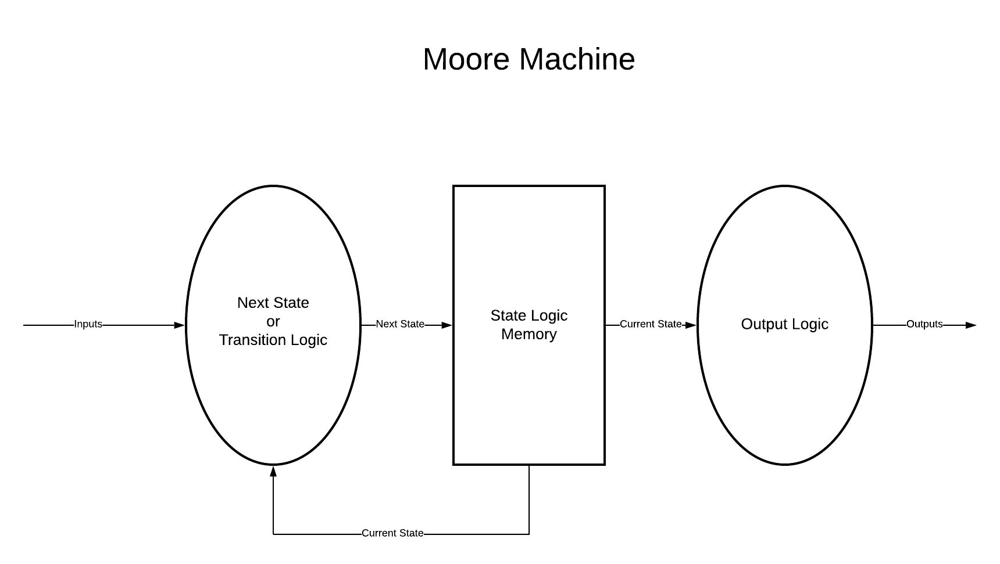
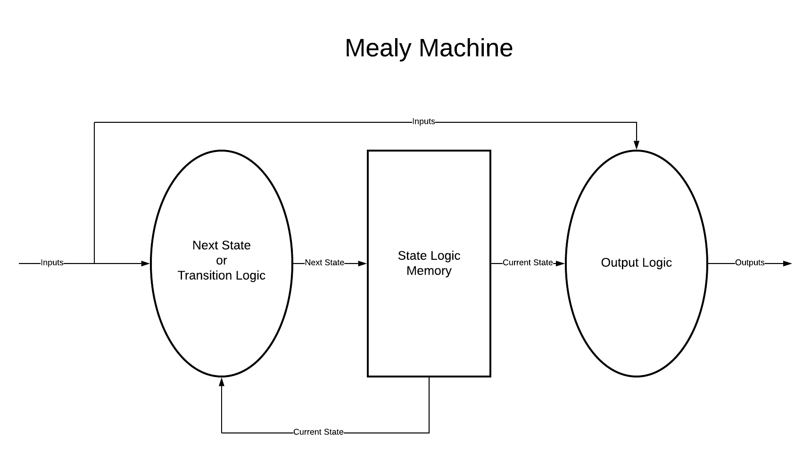
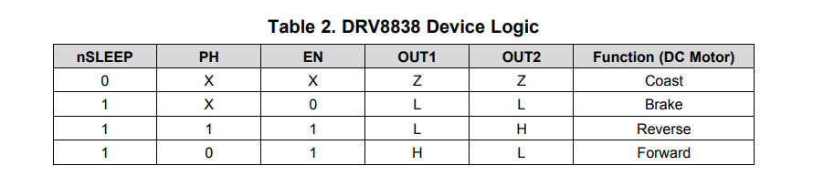
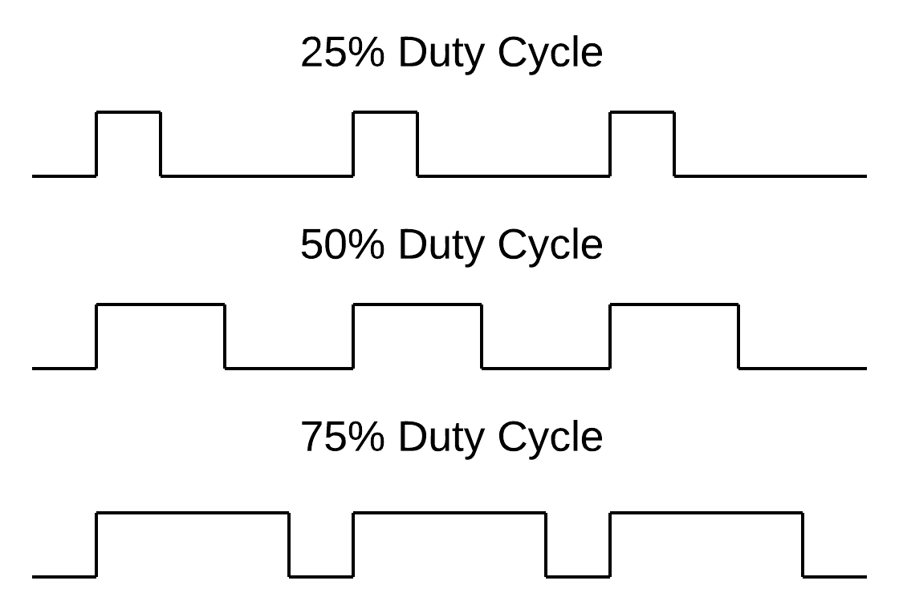
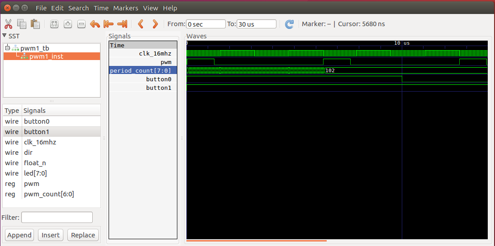

Verilog Tutorial Links:
* [Part 1](https://github.com/hbrc-fpga-class/class-material/blob/master/verilog_tutorial_part1.md)
* [Part 2](https://github.com/hbrc-fpga-class/class-material/blob/master/verilog_tutorial_part2.md)


# Verilog Tutorial Part 2 Overview

* [4 State Machine](#4_state_machine)
    * Shifting Solution
    * State Machine Solution
* [5 PWM Module](#5_pwm_module)
    * Testbench
* [6 Parameterized PWM Module](#6_param_pwm_module)
    * Parameterized Modules
    * Instantiating Modules
    * Top level Module


# [4_State_Machine](https://github.com/hbrc-fpga-class/peripherals/tree/master/verilog_tutorial/4_State_Machine)

In this section we will learn how to model state machines in Verilog.  To get
started login to your robot using ssh and perform the following steps:

```
> cd ~/hbrc_fpga_class/peripherals
> source setup.bash
> cd verilog_tutorial/4_State_Machines
```

## Kit car style leds

The target design for this section is the
[Challenge activity](https://github.com/hbrc-fpga-class/class-material/blob/master/verilog_tutorial_part1.md#challenge)
at the end of the 
[verilog_tutorial_part1](https://github.com/hbrc-fpga-class/class-material/blob/master/verilog_tutorial_part1.md).

To repeat that description:

* A group of three leds bounce back and forth, so it looks like a
  Battlestar Galactica Cylon Scanner or the Kit car in Knight Rider.

## state_machine0.v

This solution does *not* use a state machine.  Instead it uses techniques
learned in Part1.  Here is the Verilog:

```verilog
/* Kit car style leds. */
/* No state machine version. */

// Force error when implicit net has no type.
`default_nettype none

module state_machine0
(
    input wire clk_16mhz,
    input wire button0,
    input wire button1,
    output reg [7:0] led
);

// reset when button0 is pushed
wire reset = ~button0;

// button1 is an enable
wire en = button1;

// internal registers
reg inc_led;
reg [23:0] fast_count;
reg count_dir;
reg [2:0] shift_count;


// Constants
localparam DELAY_COUNT  = 1_000_000;
localparam COUNT_UP     = 0;
localparam COUNT_DOWN   = 1;

// Generate a pulse to inc_leds every
// 1/16 of a second.
always @ (posedge clk_16mhz)
begin
    if (reset) begin
        inc_led <= 0;
        fast_count <= 0;
    end else begin
        if (en) begin
            inc_led <= 0;       // default
            fast_count <= fast_count + 1;
            if (fast_count == DELAY_COUNT) begin
                inc_led <= 1;
                fast_count <= 0;
            end
        end
    end
end

// Change led direction after 5 shifts
always @ (posedge clk_16mhz)
begin
    if (reset) begin
        count_dir <= COUNT_UP;
        shift_count <= 0;
    end else begin
        if (inc_led) begin
            shift_count <= shift_count + 1;
            if (shift_count == 4) begin
                count_dir <= ~count_dir;
                shift_count <= 0;
            end
        end
    end
end

// Increment the led count.
initial led <= 8'b000_0111;
always @ (posedge clk_16mhz)
begin
    if (reset) begin
        led <= 8'b000_0111;
    end else begin
        if (inc_led) begin
            if (count_dir == COUNT_UP) begin
                led <= led << 1;
            end else begin
                led <= led >> 1;
            end
        end
    end
end

endmodule
```

Items of note:
* **button1** is used as an **en** (enable) signal.

The notation:
```verilog
wire en = button1;
```

is equivalent to:
```verilog
wire en;
assign en = button1;
```

As Verilog evolved syntax shortcuts like the above developed.
Another one we use is putting the input/output ports and
type all in the module declaration like this:

```verilog
module state_machine0
(
    input wire clk_16mhz,
    input wire button0,
    input wire button1,
    output reg [7:0] led
);
```
An older style that you will see is the input/output ports
defined after the module declaration like this:

```verilog
module state_machine0 (clk_16mhz, button0, button1, led);

// declare ports
input clk_16mhz;
input button0;
input button1;
output [7:0] led;

// declare signal types
wire clk_16mhz;
wire button0;
wire button1;
reg [7:0] led;
```

* We add the **en** signal to gate incrementing **fast_count** which
controls our **inc_led** signal.  This always block is a common
pattern with a **reset** and **en**.

```verilog
// Generate a pulse to inc_leds every
// quarter of a second.
always @ (posedge clk_16mhz)
begin
    if (reset) begin
        inc_led <= 0;
        fast_count <= 0;
    end else begin
        if (en) begin
            inc_led <= 0;       // default
            fast_count <= fast_count + 1;
            if (fast_count == DELAY_COUNT) begin
                inc_led <= 1;
                fast_count <= 0;
            end
        end
    end
end
```

* Instead of a button press to change **count_dir**.  We use
**shift_count** to determine when to switch directions.

```verilog
// Change led direction after 5 shifts
always @ (posedge clk_16mhz)
begin
    if (reset) begin
        count_dir <= COUNT_UP;
        shift_count <= 0;
    end else begin
        if (inc_led) begin
            shift_count <= shift_count + 1;
            if (shift_count == 4) begin
                count_dir <= ~count_dir;
                shift_count <= 0;
            end
        end
    end
end
```

* We initialize the leds to 8'b000_0111.  So the right three leds will
be on at power up.  We use the shift operators to shift the leds left
and right based on the **count_dir**.

```verilog
// Increment the led count.
initial led <= 8'b000_0111;
always @ (posedge clk_16mhz)
begin
    if (reset) begin
        led <= 8'b000_0111;
    end else begin
        if (inc_led) begin
            if (count_dir == COUNT_UP) begin
                led <= led << 1;
            end else begin
                led <= led >> 1;
            end
        end
    end
end
```

You can try out this code from the **4_State_Machine** directory via:

```
> make state_machine0
```


Try commenting out the **initial** line and regenerate the bitstream.
No leds, why?  Now try hitting **button0**.  What happens?

## State Machines

A **finite-state machine (FSM)** or simply **state machine** is an abstract
machine that can be in exactly one of a finite number of states at
any given time.   The state machine can transition from one state to another
in response to some inputs.  In logic control applications there are two
styles of state machines  **Moore Machines** and **Mealy Machines**.  Both
of these types can be implemented in Verilog.

* Moore Machine



* Mealy Machine



Both types of state machines have these three parts:
* **Next State Logic**.  Also called the Transition Logic.  This combines the current
  state with the inputs and generates the next state.
* **State Logic**.  This is the memory (registers) that record the current state.
* **Output Logic**.  A state machine can have multiple outputs.  In a Moore Machine
this is solely based on the current state.  In a Mealy Machine the outputs are based
on the current state and the inputs.

**Which is better?** I think it is largely a matter of taste.  But for FPGAs
I think there is a good argument for using the Moore style in that the
outputs can be synchronous with the state transitions.  And synchronous is
good in FPGAs because it helps with timing.

## State Machine Coding Style

Since there are 3 parts to making a state machine, there are many styles
to coding a state machine.  But basically boils down to:
* **Three always blocks** : The next state logic and output logic are both modeled as
  combinatorial always blocks. The state logic is a synchronous always block.
* **Two always blocks** : Two parts in one always block, and the other in another.
* **One always block** : All three parts in one always block.  This is my favorite.
This makes a Moore machine and the outputs are synchronous with the state
transitions.  It also, usually requires the least typing :-)

**Note**: The important thing is you code the state-machine in a style that
the synthesis tool will recognize as a state-machine.  Then depending on the
synthesis options, you can give it the freedom to recode it to optimize for area
or speed for example.

## state_machine1.v

```verilog
/* Light pattern leds */
/* State machine version. */

// Force error when implicit net has no type.
`default_nettype none

module state_machine1
(
    input wire clk_16mhz,
    input wire button0,
    input wire button1,
    output reg [7:0] led
);

// reset when button0 is pushed
wire reset = ~button0;

// button1 is an enable
wire en = button1;

// internal registers
reg inc_led;
reg [23:0] fast_count;
reg count_dir;
reg [2:0] shift_count;

// State machine register
reg [2:0] state;

// Constants
localparam DELAY_COUNT  = 1_500_000;
localparam COUNT_UP     = 0;
localparam COUNT_DOWN   = 1;

// State machine states
localparam STATE0  = 0;
localparam STATE1  = 1;
localparam STATE2  = 2;
localparam STATE3  = 3;
localparam STATE4  = 4;
localparam STATE5  = 5;
localparam STATE6  = 6;
localparam STATE7  = 7;

// Generate a pulse to inc_leds every
// quarter of a second.
always @ (posedge clk_16mhz)
begin
    if (reset) begin
        inc_led <= 0;
        fast_count <= 0;
    end else begin
        if (en) begin
            inc_led <= 0;       // default
            fast_count <= fast_count + 1;
            if (fast_count == DELAY_COUNT) begin
                inc_led <= 1;
                fast_count <= 0;
            end
        end
    end
end


// state machine logic
always @ (posedge clk_16mhz)
begin
    if (reset) begin
        state <= STATE0;
        led <= 0;
    end else begin
        case (state)
            STATE0 : begin
                led <= 8'b1100_0011;
                if (inc_led) begin
                    state <= STATE1;
                end
            end
            STATE1 : begin
                led <= 8'b0110_0110;
                if (inc_led) begin
                    state <= STATE2;
                end
            end
            STATE2 : begin
                led <= 8'b0011_1100;
                if (inc_led) begin
                    state <= STATE3;
                end
            end
            STATE3 : begin
                led <= 8'b0001_1000;
                if (inc_led) begin
                    state <= STATE4;
                end
            end
            STATE4 : begin
                led <= 8'b0000_0000;
                if (inc_led) begin
                    state <= STATE5;
                end
            end
            STATE5 : begin
                led <= 8'b0001_1000;
                if (inc_led) begin
                    state <= STATE6;
                end
            end
            STATE6 : begin
                led <= 8'b0011_1100;
                if (inc_led) begin
                    state <= STATE7;
                end
            end
            STATE7 : begin
                led <= 8'b0110_0110;
                if (inc_led) begin
                    state <= STATE0;
                end
            end
            default : begin
                state <= STATE0;
                led <= 0;
            end
        endcase
    end
end

endmodule
```

In this example we implement a state-machine in a single always block.
To show the flexibility of a state-machine we have changed the light
pattern, from the previous example.

A couple items to notice:

 * **The state machine register**

 ```verilog
reg [2:0] state;
 ```

 We define **state** as a register with 3 bits.  This allows us to have up
 to 8 states.

 * **State Machine states constants**

 ```verilog
localparam STATE0  = 0;
localparam STATE1  = 1;
localparam STATE2  = 2;
localparam STATE3  = 3;
localparam STATE4  = 4;
localparam STATE5  = 5;
localparam STATE6  = 6;
localparam STATE7  = 7;
 ```

Usually the state constants will have more descriptive names.

Here we define the 8 states and the encoding for each of these states.
We are using **Sequential State Encoding**.  There are other encodings 
we could have chosen such as **Gray State Encoding** or 
**One-Hot State Encoding**.  I usually stick with **Sequential State Encoding**.

If you need to change the encoding style, there are usually options in the synthesis
tools that allows you to change the encoding style without
changing the Verilog code.

* **inc_led always block**.  We still have this block to slow down the transitions.

* **state machine always block**

```verilog
always @ (posedge clk_16mhz)
begin
    if (reset) begin
        state <= STATE0;
        led <= 0;
    end else begin
        case (state)
            STATE0 : begin
                led <= 8'b1100_0011;
                if (inc_led) begin
                    state <= STATE1;
                end
            end
            STATE1 : begin
                led <= 8'b0110_0110;
                if (inc_led) begin
                    state <= STATE2;
                end
            end
            STATE2 : begin
                led <= 8'b0011_1100;
                if (inc_led) begin
                    state <= STATE3;
                end
            end
            STATE3 : begin
                led <= 8'b0001_1000;
                if (inc_led) begin
                    state <= STATE4;
                end
            end
            STATE4 : begin
                led <= 8'b0000_0000;
                if (inc_led) begin
                    state <= STATE5;
                end
            end
            STATE5 : begin
                led <= 8'b0001_1000;
                if (inc_led) begin
                    state <= STATE6;
                end
            end
            STATE6 : begin
                led <= 8'b0011_1100;
                if (inc_led) begin
                    state <= STATE7;
                end
            end
            STATE7 : begin
                led <= 8'b0110_0110;
                if (inc_led) begin
                    state <= STATE0;
                end
            end
            default : begin
                state <= STATE0;
                led <= 0;
            end
        endcase
    end
end
```

We implement the state-machine using a **case** statement.  The general
syntax for the **case** statement is the following:

```verilog
case (expr)
    0 : statement0;
    1 : statement1;
    default : default_statement;
endcase
```

Multiple statements can be grouped with a case item by putting it in a **begin** **end**
block.  It is a good idea to always include a **default** item to catch
any states that was not specified.  After a case item is executed flow
continues after the **endcase**.

Things to notice about this state-machine block:
* **state and output registers** are initialized on reset and in the **default** item.

* **A Case item** implements the three logic blocks, output logic, transition logic,
  and state logic.

```verilog
STATE0 : begin
    led <= 8'b1100_0011;
    if (inc_led) begin
        state <= STATE1;
    end
end
```

You can try out this code from the **4_State_Machine** directory via:

```
> make state_machine1
```

# [5_PWM_Module](https://github.com/hbrc-fpga-class/peripherals/tree/master/verilog_tutorial/5_PWM_Module)

In this section we will move beyond blinking leds and drive a motor.
We will do this by generating a PWM module.

Our class robot is using the 
[Pololu Motor Driver and Power Distribution Board for Romi Chassis](https://www.pololu.com/product/3543/specs).

This board uses the [TI DRV8838](https://www.pololu.com/file/0J806/drv8838.pdf) for driving the motors.

The following is a table from the datasheet.



To control the speed of the robot we can _pwm_ the **EN** pin.

We can control the direction of the motor turns via the **PH** pin.

## Pulse-width modulation (PWM)

Pulse-width modulation (pwm) is a way of adjusting the average power delivered to the motor,
so we can control the speed of the motor.  The way this is done is by adjusting the 
**ON** to **OFF** time of a periodic signal.  The ratio of the **ON** time to the **OFF**
time is called **duty cycle**.  Here are some examples of different duty cycles.



## pwm1.v

```verilog
// Force error when implicit net has no type.
`default_nettype none

module pwm1
(
    input wire clk_16mhz,
    input wire button0,
    input wire button1,
    output wire [7:0] led,

    // Motor pins
    output reg pwm,
    output wire dir,
    output wire float_n
);

// Parameters
localparam CLK_FREQUENCY = 16_000_000;
localparam PWM_FREQUENCY = 160_000;
localparam PERIOD_COUNT = (CLK_FREQUENCY/PWM_FREQUENCY);
localparam COUNT_BITS = $clog2(PERIOD_COUNT);
localparam DUTY_CYCLE = 20;


// Assignments
assign dir = ~button0;      // Button0 controls direction
assign float_n = button1;   // Button1 enables float
assign led = {6'h0,float_n,dir}; // Turn off leds

// Signals
reg [COUNT_BITS-1:0] pwm_count;

// Generate PWM
initial begin
    // added for sim
    pwm<=0; 
    pwm_count<=0;
    $display("DUTY_CYCLE: ",DUTY_CYCLE);
    $display("PERIOD_COUNT: ",PERIOD_COUNT);
    $display("COUNT_BITS: ",COUNT_BITS);
end
always @ (posedge clk_16mhz)
begin
    pwm_count <= pwm_count + 1;
    pwm <= 1;
    if (pwm_count >= DUTY_CYCLE) begin
        pwm <= 0;
    end
    if (pwm_count == PERIOD_COUNT) begin
        pwm_count <= 0;
    end
end

endmodule
```

In this example we generate a 100kHz PWM pulse with
a 20% duty cycle.  We have **button0** control the motor
direction and **button1** control the float_n pin.

We also added the following to the **pins.pcf** to
map our motor pins to the left motor

```
# Left Motor
set_io pwm          C1  # PIN_5
set_io dir          C2  # PIN_4
set_io float_n      B1  # PIN_3
```

We can try this code from the **5_PWM_Module** directory via

```
> make pwm1
```

Things to notice:

*  **Math in the Parameters**

```
localparam CLK_FREQUENCY = 16_000_000;
localparam PWM_FREQUENCY = 100_000;
localparam PERIOD_COUNT = (CLK_FREQUENCY/PWM_FREQUENCY);
localparam COUNT_BITS = $clog2(PERIOD_COUNT);
localparam DUTY_1_PERCENT = (PERIOD_COUNT/100);
localparam DUTY_CYCLE = 20;
localparam ON_COUNT = (DUTY_CYCLE*DUTY_1_PERCENT);
```
We let the Verilog Preprocessor do some math for us.
We define the CLK_FREQUENCY and PWM_FREQUENCY and then compute
how many clock ticks it takes for a PWM period which
we call **PERIOD_COUNT**.   

NOTE: This division is integer division.  The fractional part is truncated.

The **$clog2()** system function returns the ceiling of the
logarithm to the base 2.  We use this to compute the number of
bits we need for our **pwm_count** register.

* **Use a parameter in register width**

```verilog
reg [COUNT_BITS-1:0] pwm_count;
```
This is fairly common in parameterized modules.  We have the __-1__ because
it goes down to 0.

* **Concatenation operator for setting led**

```verilog
assign led = {6'h0,float_n,dir}; // Turn off leds
```

Sets led[1]=float_n and led[0]=dir, and led[7:2]=0.

* **Generating the pwm**

```verilog
initial begin
    // added for sim
    pwm<=0; 
    pwm_count<=0;
    $display("DUTY_CYCLE: ",DUTY_CYCLE);
    $display("PERIOD_COUNT: ",PERIOD_COUNT);
    $display("COUNT_BITS: ",COUNT_BITS);
end
always @ (posedge clk_16mhz)
begin
    pwm_count <= pwm_count + 1;
    pwm <= 1;
    if (pwm_count >= ON_COUNT) begin
        pwm <= 0;
    end
    if (pwm_count == PERIOD_COUNT) begin
        pwm_count <= 0;
    end
end
```

We intialize pwm and pwm_count to 0 for the simulator.  
We also have the simulator print out some parameter values.

By default we increment pwm_count and set pwm<=1.

If the pwm_count is >= ON_COUNT then pwm<=0.

If pwm_count == PERIOD_COUNT, then we reset pwm_count back to zero.
And the signal repeats.

## Testbench

How do we check that our pwm signal is really being generated as we expect?
We could use an oscilloscope, that would tell us if we are close.
It would be nice if we could tell if the waveform is correct
before generating the FPGA bitstream.

In the world of software we have debuggers.  In the world of HDL we
have simulators.  In fact Verilog was originally developed as
a language to simulate circuits.


## pwm1_tb.v

In the directory 5_PWM_Module/pwm1_tb there is a file called pwm1_tb.v which is a testbench for
testing pwm1.v.  Here is the contents of pwm1_tb.v

```verilog
// Force error when implicit net has no type.
`default_nettype none

`timescale 1 ns / 1 ps


module pwm1_tb;

// Inputs (registers)
reg clk_16mhz;
reg button0;
reg button1;

// Output (wires)
wire [7:0] led;
wire pwm;
wire dir;
wire float_n;

// Instantiate DUT (device under test)
pwm1 pwm1_inst
(
    .clk_16mhz(clk_16mhz),
    .button0(button0),
    .button1(button1),
    .led(led),  // [7:0]

    // Motor pins
    .pwm(pwm),
    .dir(dir),
    .float_n(float_n)
);

// Main testbench code
initial begin
    $dumpfile("pwm1.vcd");
    $dumpvars(0, pwm1_tb);

    // init inputs
    clk_16mhz = 0;
    button0 = 1;
    button1 = 1;

    // Wait 10us
    #10000;
    button0 = 0;

    // Wait 10us
    #10000;
    button1 = 0;

    // Wait 30us
    #10000;

    // end simulation
    $display("done: ",$realtime);
    $finish;
end

// Generate a 16mhz clk
always begin
    #31.25 clk_16mhz = ~clk_16mhz;
end

// Count pwm pulse and period
reg pwm_pre = 0;
wire pwm_posedge = pwm && ~pwm_pre;
wire pwm_negedge = ~pwm && pwm_pre;

localparam WAIT_START_COUNT = 0;
localparam WAIT_PULSE_END   = 1;
localparam WAIT_PERIOD_END  = 2;
localparam DONE             = 3;
reg [1:0] state = WAIT_START_COUNT;
reg [7:0] period_count = 0;
always @ (posedge clk_16mhz)
begin
    pwm_pre <= pwm; // for edges
    case (state)
        WAIT_START_COUNT : begin
            if (pwm_posedge) begin
                period_count <= 1;
                state <= WAIT_PULSE_END;
            end
        end
        WAIT_PULSE_END : begin
            period_count <= period_count + 1;
            if (pwm_negedge) begin
                $display("pulse_count: ",period_count);
                state <= WAIT_PERIOD_END;
            end
        end
        WAIT_PERIOD_END : begin
            period_count <= period_count + 1;
            if (pwm_posedge) begin
                $display("period_count: ",period_count);
                state <= DONE;
            end 
        end
        DONE : begin
            // done, do nothing
        end
        default : begin
            state <= WAIT_START_COUNT;
        end
    endcase
end

endmodule

```

Items to notice:

* timescale directive

```verilog
`timescale 1 ns / 1 ps
```

The timescale directive specifies the units we are using.  We are saying that our units are in
nanoseconds and the granularity is in picoseconds.  So we can have value like 1.001.

* Instantiation of the pwm1 module

```verilog
// Instantiate DUT (device under test)
pwm1 pwm1_inst
(
    .clk_16mhz(clk_16mhz),
    .button0(button0),
    .button1(button1),
    .led(led),  // [7:0]

    // Motor pins
    .pwm(pwm),
    .dir(dir),
    .float_n(float_n)
);

```

This shows how we instantiate a module.  Basically the instantiation template is:

```verilog
<module_name> <unique_instance_name>
(
    .<port1>(<signal_to_connect>),
    .<port2>(<signal_to_connect>),
    ...
    .<portn>(<signal_to_connect>)
);
```

* Declare signals to connect to DUT module

```verilog
// Inputs (registers)
reg clk_16mhz;
reg button0;
reg button1;

// Output (wires)
wire [7:0] led;
wire pwm;
wire dir;
wire float_n;
```

These signals should be declared before they are used in the
instantiation of the DUT.

The signals that are inputs into the DUT are declared as **reg**
because we need to drive them from our testbench.

The signals that are outputs from the DUT are declared as **wire**.

* The Main initial block

```verilog
// Main testbench code
initial begin
    $dumpfile("pwm1.vcd");
    $dumpvars(0, pwm1_tb);

    // init inputs
    clk_16mhz = 0;
    button0 = 1;
    button1 = 1;

    // Wait 10us
    #10000;
    button0 = 0;

    // Wait 10us
    #10000;
    button1 = 0;

    // Wait 30us
    #10000;

    // end simulation
    $display("done: ",$realtime);
    $finish;
end
```

An **initial** block is often used to run the testbench.  Since it 
starts at time 0, and runs through just once.  We also use
the blocking __=__ assignment operator, so the operations happen
sequentially.  

The lines:

```verilog
    $dumpfile("pwm1.vcd");
    $dumpvars(0, pwm1_tb);
```

Setup the Verilog simulator to generate a _Value Change Dump_ (VCD) file.
The VCD format is an ASCII format that is part of the Verilog standard.

The __$dumpvars(0, pwm1_tb)__ says to dump all of the variables
in pwm1_tb and instantiated modules to the VCD file.  The '0' is the number
of hierarchy levels to descend.  '0' is a special value that means ALL levels.

Next we initialize our **reg** signals that are inputs to the DUT.

We can then use the __#__ delay operator to wait the specified number
of simulation time.  Because of the __`timescale__ directive this is in __ns__.

Lastly when we are done we call the system task __$finish__ to end
the simulation.


* Generate our 16mhz clk

```verilog
// Generate a 16mhz clk
always begin
    #31.25 clk_16mhz = ~clk_16mhz;
end
```

We need to generate our clk_16mhz to drive our DUT module.
We can use the __#__ delay operator to invert the signal at
the specified rate.

A full period is 31.25ns * 2 = 62.5ns.  The frequency is INV(62.5ns) = 16Mhz.

* Verify the PWM signal is what we expect.

```verilog
// Count pwm pulse and period
reg pwm_pre = 0;
wire pwm_posedge = pwm && ~pwm_pre;
wire pwm_negedge = ~pwm && pwm_pre;

localparam WAIT_START_COUNT = 0;
localparam WAIT_PULSE_END   = 1;
localparam WAIT_PERIOD_END  = 2;
localparam DONE             = 3;
reg [1:0] state = WAIT_START_COUNT;
reg [7:0] period_count = 0;
always @ (posedge clk_16mhz)
begin
    pwm_pre <= pwm; // for edges
    case (state)
        WAIT_START_COUNT : begin
            if (pwm_posedge) begin
                period_count <= 1;
                state <= WAIT_PULSE_END;
            end
        end
        WAIT_PULSE_END : begin
            period_count <= period_count + 1;
            if (pwm_negedge) begin
                $display("pulse_count: ",period_count);
                state <= WAIT_PERIOD_END;
            end
        end
        WAIT_PERIOD_END : begin
            period_count <= period_count + 1;
            if (pwm_posedge) begin
                $display("period_count: ",period_count);
                state <= DONE;
            end 
        end
        DONE : begin
            // done, do nothing
        end
        default : begin
            state <= WAIT_START_COUNT;
        end
    endcase
end
```

We use a state-machine to count how long how many clock cycles
the PWM has the value of 1, and how many clock cycles the whole
period is.  We then print out the values using __$display__.
This is a little bit like debugging with __printf__ statements in C.

## Run the simulation

There is a **Makefile** in the **5_PWM_Module/pwm1_tb** directory
that will run the simulation.

It uses a file called __pwm1.vf__ which contains the list of files
for iverilog to simulate.  In this pwm1.vf contains:

```
pwm1_tb.v
../pwm1.v
```

The Makefile has the following targets:
* **make compile**:     Compile only
* **make run**:         Runs simulation
* **make view**:        Starts GTKWave
* **make clean**:       Cleans generated files

Let's try running the simulation

```
> make run
...
vvp pwm1.vvp
DUTY_CYCLE:  20
PERIOD_COUNT:  100
COUNT_BITS:           7
VCD info: dumpfile pwm1.vcd opened for output.
pulse_count:  20
period_count: 101
done: 30000.000
```

What we see here is our DUTY_CYCLE param is 20 and our pulse_count is 20.
So that is what we expect.  So that test passes.

However our PERIOD_COUNT param is 100 and our period_count from the testbench
is 101. That does **NOT** match.  So we have a **bug**.

But is the **bug** in our testbench or is it in our module?

Let's look at the simulated PWM waveform to find out.

## View the waveform

We can use the tool [GTKWave](http://gtkwave.sourceforge.net/) to view the waveform data inside
the __pwm1.vcd__ file

There is information on how to setup the GTKWave viewer [here](gtkwave.md).

If you have setup your robot to forward X11 over SSH 
(i.e. you logged in to your robot via "ssh -X ubuntu@h01.local")

You can type

```
> make view
```

If you are using SSHFS navigate to the __5_PWM_Module/pwm1_tb__ directory and
double click on the __pwm1.vcd__ to start GTKWave.

We will interactively select the signals we are interested and add them
to the signals area.  When we are done it will look something like this:



Controls:
* You can move in and out of the waveform by holding **Ctrl** while using the mouse scroll wheel.
* You can move the waveform size to size by just using the scroll wheel.
* To make a measurement.  Set the lower bound marker using the "middle" mouse button.  Set the upper
  bound marker using the left mouse button.  The marker distance will be in the toolbar
  area above the waveform window.

If you like your waveform setup you can save it as a .gtkw file via File->Write Save File.

## Fix the bug.

The bug is in the pwm1.v file.  Basically the PWM period is one clock cycle too long.

**Challenge**

Fix the bug in pwm1.v and run the simulation and view the waveform to
verify the bug has been fixed.


# [6_Param_PWM_Module](https://github.com/hbrc-fpga-class/peripherals/tree/master/verilog_tutorial/6_Param_PWM_Module)

In this section we turn our pwm module into a proper parameterized module.
Then we create a __top.v__ module and instantiate two **pwm** modules,
one for the left motor and one for the right motor.

## Parameterized pwm.v

```verilog
// Force error when implicit net has no type.
`default_nettype none

module pwm #
(
    parameter CLK_FREQUENCY = 16_000_000,
    parameter PWM_FREQUENCY = 160_000,
    parameter PERIOD_COUNT = (CLK_FREQUENCY/PWM_FREQUENCY),
    parameter COUNT_BITS = $clog2(PERIOD_COUNT),
    parameter DUTY_CYCLE = 20
)
(
    input wire clk_16mhz,
    input wire dir_ctrl,
    input wire float_ctrl,

    // Motor pins
    output reg pwm,
    output wire dir,
    output wire float_n
);

// Assignments
assign dir = ~dir_ctrl;      // controls direction
assign float_n = float_ctrl;   // enables float

// Signals
reg [COUNT_BITS-1:0] pwm_count;

// Generate PWM
always @ (posedge clk_16mhz)
begin
    pwm_count <= pwm_count + 1;
    pwm <= 1;
    if (pwm_count >= DUTY_CYCLE) begin
        pwm <= 0;
    end
    if (pwm_count == (PERIOD_COUNT-1)) begin
        pwm_count <= 0;
    end
end

endmodule
```

The most notable difference is we moved the **localparam** definitions into
the module definition block and called them **parameter**.

The parameter section is indicated by the __#__ before the open __(__.
It comes before the port declaration section.

It is also possible to put the **parameter** definitions as regular
statements further down in the module.  This is an older style.
I like putting the **parameter** declaration in the module header
to make it clear that they can be modified.

We also renamed the ports **button0** and **button1** to **dir_ctrl** and **float_ctrl**.

## top.v

```verilog
module top
(
    input wire  clk_16mhz,

    // basicio
    input wire [1:0] button,
    output wire [7:0] led,

    // motor pins
    output wire [1:0] pwm,
    output wire [1:0] dir,
    output wire [1:0] float_n
);

localparam LEFT     = 0;
localparam RIGHT    = 1;

assign led = {6'h0,button[1],button[0]}; 

// Instantiate PWM modules

pwm #
(
    .DUTY_CYCLE(20)
) pwm_left
(
    .clk_16mhz(clk_16mhz),
    .dir_ctrl(button[0]),
    .float_ctrl(button[1]),

    // Motor pins
    .pwm(pwm[LEFT]),
    .dir(dir[LEFT]),
    .float_n(float_n[LEFT])
);

pwm #
(
    .DUTY_CYCLE(30)
) pwm_right
(
    .clk_16mhz(clk_16mhz),
    .dir_ctrl(button[1]),
    .float_ctrl(button[0]),

    // Motor pins
    .pwm(pwm[RIGHT]),
    .dir(dir[RIGHT]),
    .float_n(float_n[RIGHT])
);

endmodule
```

This is our top module.  In it we instantiate two copies of
the **pwm** module, one called **pwm_left** and another called **pwm_right**.

We are able to customize the DUTY_CYCLE parameter and make them different
in each instance.  The left DUTY_CYCLE will be 20, and the right DUTY_CYCLE
will be 30.  So the right wheel will spin faster.

Parameters that we don't specify will have default values from pwm.v.

We also swap the buttons from **pwm_left** to **pwm_right**. So
* **button[0]** will change the direction of the left motor and stop the right motor.
* **button[1]** will change the direction of the right motor and stop the left motor.

We also updated the pins.pcf to add the right motor pins.

There is also a file called **compile.vf** which can be used by iverilog
to do a syntax check of our two modules. Via the command

```
> iverilog -c compile.vf
```

## Challenge

For a challenge you can update top.v and pwm.v so that:
* The motors go the same speed
* Button1, makes the motors go faster
* Button0, makes the motors go slower

Extra Credit:
* If motor speed "goes negative" change motor direction.

#  That's it!

That completes part_2 of this Verilog tutorial.  With the information
you learned from [part_1](verilog_tutorial_part1.md) and part_2, you should be able to 
understand most of the HBA Verilog peripherals in this repository.


