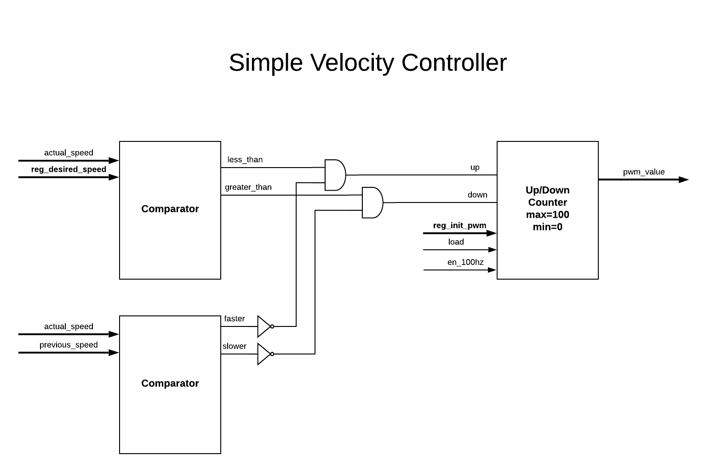

Verilog Tutorial Links:
* [Part 1](https://github.com/hbrc-fpga-class/class-material/blob/master/verilog_tutorial_part1.md)
* [Part 2](https://github.com/hbrc-fpga-class/class-material/blob/master/verilog_tutorial_part2.md)
* [Part 3](https://github.com/hbrc-fpga-class/class-material/blob/master/verilog_tutorial_part3.md)

# Verilog Tutorial Part 3 Overview

* Putting it all together
* HBA Architecture Review
* Design of a Speed Controller Peripheral
* Design of the Speed Controller Driver
* Implementation of Speed Controller Peripheral
* Adding to the main project
* Building a new project
* Implementation of the Speed Controller Driver
* Testing the peripheral and driver

# Putting it all together

At the beginning of the class we took a top down approach and 
learned about the HBA architecture and how the FPGA peripherals 
communicate with the hbadaemon running on the Raspberry Pi,
and how to write Python apps that talk to the hbadaemon.

Then we took a bottom up approach and learned the basics
of Verilog and how to synthesize designs for the FPGA.

In this class we will bring it all together by building
a peripheral that we will add to the HBA FPGA architecture.
We will then write a hbadaemon driver, and an app to
test our new peripheral.

# HBA Architecture Review

  * [HBA Daemon presentation (.md)](hbadaemon_talk.md)
  * [HBA FPGA Architecture presentation (.md)](hbafpga_talk.md) [(.pdf)](hbafpga_talk_slides.pdf)

# Design of Speed Controller Peripheral

* Driver sets **reg_desired_speed** and **reg_init_pwm** which is 
an estimate pwm to get the robot to move at the desired speed.
* Speed is measures in encoder ticks per .01 seconds.
* Use up/down counter to generate PWM value.  
* If we are going too slow and not accelerating bump up the PWM value.
* If we are going too fast and not deaccelerating bump down the PWM
  value.

